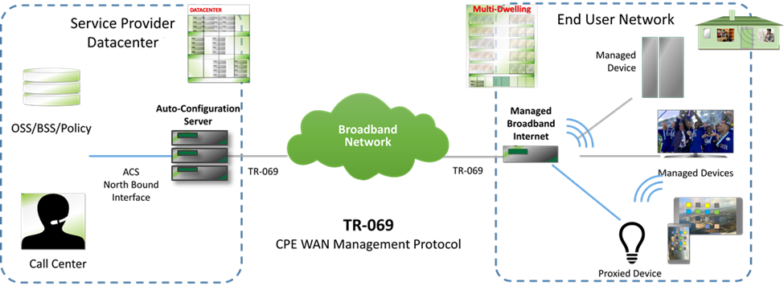

---
# BBF-specific metadata; c.f. Word properties
bbfNumber: TR-106
bbfTitle: Data Model Template for CWMP Endpoints and USP Agents
bbfIssue: Issue
bbfVersion: 1 Amendment 11
bbfMonth: January
bbfYear: 2022
bbfType: Technical Report
bbfStatus:
bbfContrib:

# information shown on each page header
siteurl: index.html

tagline: How to use the data model schema to understand and develop CWMP/USP
         data models

# displayed version number
# XXX needs to be aligned with bbfNumber; should have only one version number
versionNumber: 1.11

# don't display these in the banner
version: ''
status: ''

# information shown in the footer
# XXX what short name should we use?
shortname: '%bbfNumber%'
reponame: data-model-template

# navigation buttons shown on each page header
buttons:
- label: HTML
  title: '%bbfNumber% Single-file HTML'
  url: index.htm
- label: PDF
  title: '%bbfNumber% PDF'
  url: index.pdf
- label: CWMP Data Models
  url: https://cwmp-data-models.broadband-forum.org
- label: USP Data Models
  url: https://usp-data-models.broadband-forum.org

# these references assume use of bbf.csl; please follow the existing style
references:

- id: RFC2119
  call-number: RFC 2119
  title: Key words for use in RFCs to Indicate Requirement Levels
  publisher: IETF
  issued: {year: 1997}
  URL: https://tools.ietf.org/html/rfc2119

- id: RFC2648
  call-number: RFC 2648
  title: A URN Namespace for IETF Documents
  publisher: IETF
  issued: {year: 1999}
  URL: https://tools.ietf.org/html/rfc2648

- id: RFC3986
  call-number: RFC 3986
  title: 'Uniform Resource Identifier (URI): Generic Syntax'
  publisher: IETF
  issued: {year: 2005}
  URL: https://tools.ietf.org/html/rfc3986

- id: TR-069
  call-number: TR-069 Amendment 6 Corrigendum 1
  title: CPE WAN Management Protocol
  publisher: Broadband Forum
  issued: {year: 2020}
  URL: https://www.broadband-forum.org/technical/download/TR-069.pdf

- id: TR-140
  call-number: TR-140 Amendment 3
  title: TR-069 Data Model for Storage Service Enabled Devices
  publisher: Broadband Forum
  issued: {year: 2017}
  URL: https://www.broadband-forum.org/technical/download/TR-140.pdf

- id: TR-143
  call-number: TR-143 Amendment 1 Corrigendum 1
  title: Enabling Network Throughput Performance Tests and Statistical Monitoring
  publisher: Broadband Forum
  issued: {year: 2015}
  URL: https://www.broadband-forum.org/technical/download/TR-143.pdf

- id: TR-181i2
  call-number: TR-181 Issue 2
  title: Device Data Model
  publisher: Broadband Forum
  URL: https://usp-data-models.broadband-forum.org#Device:2

- id: TR-369
  call-number: TR-369
  title: User Services Platform
  URL: https://usp.technology/specification

- id: OUI
  title: Organizationally Unique Identifiers (OUIs)
  publisher: IEEE
  URL: https://standards.ieee.org/faqs/OUI.html

- id: SOAP
  title: Simple Object Access Protocol (SOAP) 1.1
  publisher: W3C
  issued: {year: 2000}
  URL: https://www.w3.org/TR/2000/NOTE-SOAP-20000508

- id: XML
  title: Extensible Markup Language (XML) 1.0 (Fourth Edition)
  publisher: W3C
  issued: {year: 2008}
  URL: https://www.w3.org/TR/REC-xml

- id: XML-Schema-Primer
  title: 'XML Schema Part 0: Primer Second Edition'
  publisher: W3C
  issued: {year: 2004}
  URL: https://www.w3.org/TR/xmlschema-0

- id: XML-Schema-Datatypes
  title: 'XML Schema Part 2: Datatypes Second Edition'
  publisher: W3C
  issued: {year: 2004}
  URL: https://www.w3.org/TR/xmlschema-2

# div templates
myBaseURL: 'https://www.broadband-forum.org/download'

bbfRevisionHistory:

- number: Issue 1
  approval: September 2005
  editors: |
      Jeff Bernstein, 2Wire \
      Christele Bouchat, Alcatel \
      Tim Spets, Westell
  changes: Original

- number: '[Issue 1 Amendment 1](%myBaseURL%/TR-106_Amendment-1.pdf)'
  approval: November 2006
  editors: |
      Jeff Bernstein, 2Wire \
      John Blackford, 2Wire \
      Mike Digdon, SupportSoft \
      Heather Kirksey, Motive \
      William Lupton, 2Wire \
      Anton Okmianski, Cisco
  changes: Clarification of original document

- number: '[Issue 1 Amendment 2](%myBaseURL%/TR-106_Amendment-2.pdf)'
  approval: November 2008
  editors: |
      William Lupton, 2Wire \
      H&aring;kan Westin, Tilgin
  changes: Addition of data model definition XML Schema and normative
           XML common object and component definitions

- number: '[Issue 1 Amendment 3](%myBaseURL%/TR-106_Amendment-3.pdf)'
  approval: September 2009
  editors: |
      William Lupton, 2Wire \
      H&aring;kan Westin, Tilgin
  changes: Addition of device type XML Schema

- number: '[Issue 1 Amendment 4](%myBaseURL%/TR-106_Amendment-4.pdf)'
  approval: February 2010
  editors: |
      William Lupton, 2Wire \
      Paul Sigurdson, Broadband Forum
  changes: Moved data model definitions to TR-181 Issue 1

- number: '[Issue 1 Amendment 5](%myBaseURL%/TR-106_Amendment-5.pdf)'
  approval: November 2010
  editors: Paul Sigurdson, Broadband Forum
  changes: |
      Replaced definitions of named data types such as IPAddress with
      references to normative XML. \
      Minor changes to DM Schema (v1.3) and DT Schema (v1.1).

- number: '[Issue 1 Amendment 6](%myBaseURL%/TR-106_Amendment-6.pdf)'
  approval: July 2011
  editors: |
      Sarah Banks, Cisco \
      Andrea Colmegna, FASTWEB \
      Tim Spets, Motorola Mobility
  changes: |
      Removed definition of proxying, now defined in TR-069. \
      Removed Common objects.\
      Alias Parameter Requirements added.

- number: '[Issue 1 Amendment 7](%myBaseURL%/TR-106_Amendment-7.pdf)'
  approval: September 2013
  publication: 7 October 2013
  editors: William Lupton, Cisco
  changes: |
      Added descriptions of new features in DM Schema (v1.4 & v1.5) and DT
      Schema (v1.2 & v1.3). \
      Added Annex defining additional requirements for BBF standard data
      models.

- number: '[Issue 1 Amendment 8](%myBaseURL%/TR-106_Amendment-8.pdf)'
  approval: 16 March 2018
  publication: 10 May 2018
  editors: |
      Jean-Didier Ott, Orange \
      William Lupton, Broadband Forum
  changes: |
      Added support of USP (mountable objects). \
      Removed references to obsolete data models. \
      Moved device requirements to TR-069.

- number: Issue 1 Amendment 9
  changes: |
      Schema updates; document not updated.

- number: '[Issue 1 Amendment 10](%myBaseURL%/TR-106_Amendment-10.pdf)'
  approval: 5 November 2020
  publication: 5 November 2020
  editors: |
      William Lupton, Broadband Forum
  changes: |
      Converted document to markdown. \
      Various editorial improvements.

- number: '[Issue 1 Amendment 11](%myBaseURL%/TR-106_Amendment-11.pdf)'
  approval: 27 January 2022
  publication: 27 January 2022
  editors: |
      William Lupton, Broadband Forum
  changes: |
      Clarified forcedEnabled and forceDefaultEnabled for USP. \
      Clarified impact of deprecating or obsoleting profile items. \
      Documented new description templates. \
      Documented new `secured` attribute.

bbfEditors:
- William Lupton, Broadband Forum

# this shows how to override a div template spec (to add BUS)
bbfWADsSpec:
  title: |
    ### Broadband User Services Work Area Director(s) {.unnumbered .unlisted}

bbfWADs:
- Jason Walls, QA Cafe
- John Blackford, CommScope

# end of metadata
---

!include cover-page.md

!include tr-notice.md

!include front-matter.md

# Executive Summary {.unnumbered .unlisted .new-page}

%bbfNumber% specifies data model guidelines to be followed by all CWMP [@TR-069]
Endpoints and USP [@TR-369] Agents. These guidelines include structural
requirements for the data hierarchy, requirements for versioning of data
models, and requirements for defining profiles.

In addition, %bbfNumber% defines an XML Schema that as far as possible
embodies these guidelines, and which is used for defining all CWMP and
USP data models. This makes data model definitions rigorous, and helps
to reduce the danger that different implementations will interpret data
model definitions in different ways.

%bbfNumber% also defines an XML Schema that allows a device to describe its
supported CWMP data models. This description is both specific and
detailed, allowing a Controller to know exactly what is supported by the
device, including any vendor-specific objects and parameters. Use of
this Schema enhances interoperability and significantly eases the
integration of new devices with a Controller. USP uses a different
mechanism (GetSupportedDM message) for the same purpose. That mechanism
is specified in TR-369 [@TR-369].

::: note

**Important warning**

The InternetGatewayDevice:1 (TR-098) and Device:1 (TR-181 Issue 1) Root
Data Models are now DEPRECATED and any reference to elements specific to
those models have been removed from this document.

The last revision of TR-106 to be used with those models is TR-106
Amendment 7.

TR-157 data models Components have been incorporated into Device:2.12.
TR-157 is therefore also DEPRECATED.

:::

# Introduction

**CWMP**

TR-069 [@TR-069] defines the generic requirements of the CPE WAN Management
Protocol (CWMP) methods which can be applied to any CWMP Endpoint. It is
intended to support a variety of different functionalities to manage a
collection of CPE, including the following primary capabilities:

-   Auto-configuration and dynamic service provisioning

-   Software/firmware image management

-   Status and performance monitoring

-   Diagnostics

The ability to manage the home network remotely has a number of benefits
including reducing the costs associated with activation and support of
broadband services, improving time-to-market for new products and
services, and improving the user experience.

The following figure places TR-069 in the end-to-end management
architecture:

{#fig:cwmp-positioning}

The ACS is a server that resides in the network and manages devices in
the subscriber premises. It uses the methods, or RPCs, defined in TR-069
to get and set the state of the device, initiate diagnostic tests,
download and upload files, and manage events. Some portions of this
state are common across managed devices and some are relevant only to
certain device types or services.

**USP**

The [User Services Platform](http://usp.technology) supports a network
of USP Controllers and USP Agents to allow applications to manipulate
service elements (i.e. objects). It represents the evolution of CWMP
into the following use cases:

-   Improvements on TR-069 based on deployment experience

-   Multi-tenant management of a given endpoint (that is, manipulation
    by multiple controllers)

-   Application to additional market spaces, including consumer
    electronics and the Internet of Things

An agent exposes service elements to one or more controllers, either
directly or by proxy. An application could use a Controller to manage a
provider controlled system, as in a CWMP ACS, or to act as a user portal
in the cloud, on a gateway, or accessed through a smart phone. Agents
and controllers can also be used in tandem to create a peer-to-peer
network of smart applications, such as an automated smart home.

{#fig:usp-architecture}

USP was designed in a modular manner, and can make use of the CWMP data
model and data model schema in order to represent an evolution of CWMP
into the world of consumer electronics, virtual services, and the
Internet of Things. As such, this document describes how to use the data
model schema in both the context of CWMP and USP.

**Specification Structure**

@fig:spec-structure shows the overall specification structure for the CWMP [@TR-069] and
USP [@TR-369] family of standards (as currently defined). Please note that
this will gradually become out of date as new documents are published.

{#fig:spec-structure}

TR-069 [@TR-069] defines the generic requirements of the CWMP methods which
can be applied to any CWMP Endpoint. TR-369 [@TR-369] does the same for USP
Agents. TR-106 (this document) specifies a baseline object structure to
be supported by any CWMP Endpoint or USP Agent (referred to generically
as an *Agent*). It specifies how to structure and define data models,
which are collections of objects and parameters on which the generic
methods act to configure, diagnose, and monitor the state of specific
devices and services. The actual data models are defined in their own
specifications.

For a particular type of device, it is expected that the baseline
defined in a document such as TR-181i2 [@TR-181i2] would be augmented with
additional objects and parameters specific to the device type. The data
model used in any Agent MUST follow the guidelines described in this
document. These guidelines include the following aspects:

-   Structural requirements for the data hierarchy

-   Requirements for versioning of data models

-   Requirements for defining profiles

In addition, this document defines two XML Schemas:

-   An XML Schema that as far as possible embodies these guidelines, and
    which is used for defining all CWMP and USP data models. This makes
    data model definitions rigorous, and helps to reduce the danger that
    different implementations will interpret data model definitions in
    different ways.

-   An XML Schema that allows a device to describe its supported CWMP
    data models. This description is both specific and detailed,
    allowing an ACS to know exactly what is supported by the CPE,
    including any vendor-specific objects and parameters. Use of this
    Schema enhances interoperability and significantly eases the
    integration of new devices with an ACS.

    Please note that USP uses a different mechanism (GetSupportedDM
    message) for the same purpose. It is specified in TR-369 [@TR-369].

## Terminology

The following terminology is used throughout this %bbfType%.

|                                    |
|------------------------------------|---------------------------------------------------------------------------------------------------------------
| **ACS**                            | Auto-Configuration Server. This is a component in the broadband network responsible for *CWMP* auto-configuration of the *CPE* for advanced services.
| **Agent**                          | A generic term that refers (as appropriate) to either a *CWMP Endpoint* or to a *USP Agent*.
| **BBF**                            | The Broadband Forum.
| **Base Supported Data Model**      | The *Data Model* that is supported by all *CPE* of a given make, model and firmware version. This refers to the *Objects,* *Parameters, Commands* and/or *Events* that have code support in the current firmware.
| **CPE**                            | Customer Premises Equipment; refers (as appropriate) to any *CWMP*-enabled [@TR-069] or *USP*-enabled [@TR-369] device and therefore covers both Internet Gateway devices and LAN-side end devices.
| **Command**                        | A named element allowing a *USP Controller* to execute an operation on a *USP Agent*. This concept does not apply to *CWMP*, which uses *Objects* and/or *Parameters* to simulate operations.
| **Component**                      | A named collection of *Objects,* *Parameters, Commands, Events* and/or *Profiles* that can be included anywhere within a *Data Model*.
| **Controller**                     | A generic term that refers (as appropriate) to either a *CWMP ACS* or a *USP Controller*.
| **Current Supported Data Model**   | The *Data Model* that is currently supported by an individual *CPE*, i.e. the *Base Supported Data Model* plus any additional *Objects*, *Parameters*, *Commands* and/or *Events* supported by extra modules that have been installed on the *CPE*. This refers to the *Objects*, *Parameters,* *Commands* and/or *Events* that have code support in the *CPE*.
| **CWMP**                           |*CPE* WAN Management Protocol. Defined in TR-069 [@TR-069], CWMP is a communication protocol between an *ACS* and CWMP-enabled *CPE* that defines a mechanism for secure auto-configuration of a *CPE* and other *CPE* management functions in a common framework.
| **CWMP Endpoint**                  | A *CWMP* termination point used by a CWMP-enabled *CPE* for communication with the *ACS.*
| **Data Model**                     | A hierarchical set of *Objects*, *Parameters*, *Commands* and/or *Events* that define the managed *Objects* accessible via a particular *Agent*.
| **Device**                         | Used here as a synonym for *CPE*.
| **DM Instance**                    | Data Model Schema instance document. This is an XML document that conforms to the *DM Schema* and to any additional rules specified in or referenced by the *DM Schema*.
| **DM Schema**                      | Data Model Schema. This is the XML Schema [@XML-Schema-Primer] that is used for defining data models for use with *CWMP* and *USP*.
| **DT Instance**                    | Device Type Schema instance document. This is an XML document that conforms to the *DT Schema* and to any additional rules specified in or referenced by the *DT Schema*. This concept is useful for both CWMP and USP as an offline design tool, but only CWMP uses it at run-time (via the SupportedDataModel Object; see @sec:the-supported-data-model-and-the-instantiated-data-model).
| **DT Schema**                      | Device Type Schema. This is the XML Schema [@XML-Schema-Primer] that is used for describing a *Device*'s *Supported Data Model*. This concept is useful for both CWMP and USP as an offline design tool, but only CWMP uses it at run-time (via the SupportedDataModel Object; see @sec:the-supported-data-model-and-the-instantiated-data-model).
| **Event**                          | An indication that something of interest has happened that requires the *Agent* to notify the *Controller*.
| **Instantiated Data Model**        | The *Data Model* that currently exists on an individual *CPE*. This refers to the *Object* instances, *Parameters*, *Commands* and/or *Events* that currently exist within the data model. It can be thought of as the *Current Supported Data Model* with all the "{i}" placeholders expanded to be the actual *Instance Numbers*. For example, "Device.Services.ABCService.{i}." in the *Current Supported Data Model* might correspond to "Device.Services.ABCService.1." and "Device.Services.ABCService.2." in the *Instantiated Data Model*.
| **Instance Alias**                 | A writeable string that uniquely identifies an instance within a *Multi-Instance Object*
| **Instance Identifier**            | A value that uniquely identifies an instance within a *Multi-Instance Object*. It is either an *Instance Number* or an *Instance Alias*.
| **Instance Number**                | A read-only positive integer (\>=1) that uniquely identifies an instance within a *Multi-Instance Object.*
| **Mountable Object**               | An *Object* that is defined in a *DM Instance* as a direct child of the *Root Object*, but that can also exist as a child of a *Mount Point* in the *Instantiated Data Model* of a *USP Agent*. This concept does not apply to *CWMP*.
| **Mount Point**                    | An *Object* that is defined in a *DM Instance* as being able to have *Mountable Objects* as children in the *Instantiated Data Model* of a *USP Agent*. By extension, one of the instances of that object in the *Instantiated Data Model*. This concept does not apply to *CWMP*.
| **Multi-Instance Object**          | An *Object* that can have multiple instances, all of which are located at the same level within the name hierarchy. Each instance is identified by an *Instance Identifier*.
| **Object**                         | An internal node in the name hierarchy, i.e., a node that can have *Object*, *Parameter*, *Command* and/or *Event* children. An *Object* name is a *Path Name*.
| **Parameter**                      | A name-value pair that represents part of a *CPE* or *USP Agent*'s configuration or status. A Parameter name is a *Path Name*.
| **Path Name**                      | A name that has a hierarchical structure similar to files in a directory, with each level separated by a "." (dot). References an *Object*, *Parameter,* *Command* or *Event*.
| **Profile**                        | A named collection of requirements relating to a given *Root Object*, *Service Object* or *Component*.
| **RPC**                            | Remote Procedure Call.
| **Root Object**                    | The top-level *Object* of a *CPE*'s *Data Model* that contains all of the manageable *Objects*. The name of the Root *Object* is "Device.".
| **Service Element**                | A Service Element represents a piece of service functionality that is exposed by an Agent, usually represented by one or more Objects.
| **Service Object**                 | The top-most *Object* associated with a specific service within which all *Objects*, *Parameters,* *Commands* and *Events* associated with the service are contained.
| **Supported Data Model**           | Refers to either *Base Supported Data Model* or *Current Supported Data Model*, depending on the context.
| **URI**                            | Uniform Resource Identifier.
| **URL**                            | Uniform Resource Locator.
| **USP**                            | Universal Service Platform. Defined in TR-369, USP is an evolution of CWMP that allows applications to manipulate Service Elements in a network of Controllers and Agents.
| **USP Agent**                      | A USP Agent is a USP Endpoint that exposes Service Elements to one or more USP Controllers.
| **USP Controller**                 | A USP Controller is a USP Endpoint that manipulates Service Elements through one or more USP Agents.
| **USP Endpoint**                   | A USP Endpoint is a termination point for a USP message.

## Document Conventions

The key words "MUST", "MUST NOT", "REQUIRED", "SHALL", "SHALL
NOT", "SHOULD", "SHOULD NOT", "RECOMMENDED", "MAY", and
"OPTIONAL" in this document are to be interpreted as described in [@RFC2119].

# Architecture

All elements described hereunder apply to both CWMP and USP, unless
specifically mentioned otherwise.

## Data Hierarchy

The data model for a Agent will follow a common set of structural
requirements. The detailed structure depends on the nature of the Agent.

An Agent's data model will always have a single Root Object, which will
be called "Device.".

The Root Object contains three types of sub-elements: the Objects
defined in TR-181i2 [@TR-181i2], Components defined in TR-181i2 or other
specifications such as TR-143 [@TR-143], and a single "Services" object that
contains all Service Objects associated with specific services.

A single Agent might include more than one Service Object. For example,
a device that serves both as a VoIP endpoint and a game device, might
include both VoIP-specific and game-specific Service Objects.

A single Agent might also include more than one instance of the same
type of Service Object. An example of when this might be appropriate is
an Agent that provides an instance of the TR-140 [@TR-140] StorageService
for each of the device's attached disks.

### Data Hierarchy Requirements

A CWMP or USP data model MUST adhere to the following structural
requirements:

1)  A root data model definition MUST contain exactly one Root Object,
    called "Device.".

2)  A Root Object definition MUST contain exactly one "Services."
    object.

3)  A service data model definition MUST define an object hierarchy that
    starts just under the "Device.Services." object.

4)  For each Multi-Instance Object defined, a data model MUST also
    define a corresponding parameter indicating the number of instances
    of the Multi-Instance Object. The name of this parameter MUST be the
    name of the object concatenated with "NumberOfEntries". This
    parameter MUST appear in the same object as the Multi-Instance
    Object it is related to.

Formally, the top level of the data hierarchy is defined as follows:

```
    Element = "Device"
            | "Device." TR-181DeviceObject
            | "Device.Services." ServiceObject "NumberOfEntries"
            | "Device.Services." ServiceObject ".{i}"

    TR-181DeviceObject = // As defined in TR-181i2, e.g. "UserInterface" or "ManagementServer"

    ServiceObject = // As defined in other specs, e.g. TR-140
```


### The Supported Data Model and the Instantiated Data Model

There is a distinction between an Agent's Supported Data Model and its
Instantiated Data Model.

-   The Supported Data Model is those Objects and/or Parameters that
    have code support in the Agent.

-   The Instantiated Data Model is those Object instances and/or
    Parameters that currently exist.

TR-181i2 [@TR-181i2] defines a SupportedDataModel Object that allows an Agent
to indicate its Supported Data Model to a Controller, which assists the
Controller in managing that device.

The SupportedDataModel object has the following properties:

1)  It contains a list of URLs, each of which allows the Controller to
    determine details of part of the Supported Data Model.

2)  When the Supported Data Model changes, e.g. because software is
    loaded or unloaded, entries are added to or removed from this list
    of URLs.

This object is not used with USP. TR-369 [@TR-369] defines the
GetSupportedDM message to provide this information.


## Object Versioning

To allow the definition of a Service Object or Root Object to change
over time, the definition of a Service Object or Root Object MUST have
an explicitly specified version.

Version numbering of Service Objects and Root Objects is defined to use
a major/minor version numbering convention. The object version is
defined as a pair of integers, where one integer represents the major
version, and the second integer represents the minor version. The
version MUST be written with the two integers separated by a dot
(Major.Minor).

The first version of a given object SHOULD be defined as version "1.0".

For each subsequent version of the object, if the later version is
compatible with the previous version, then the major version SHOULD
remain unchanged, and the minor version SHOULD be incremented by one.
For example, the next compatible version after "2.17" would be "2.18".
The requirements for a version to be considered compatible with an
earlier version are described in @sec:requirements-for-compatible-versions.

For each subsequent version of the object, if the later version is not
compatible with the previous version, then the major version MUST
increment by one, and the minor version MAY reset back to zero. For
example, the next incompatible version after "2.17" might be "3.0".

### Requirements for Compatible Versions

For one version of an object to be considered compatible with another
version, the later version MUST be a strict superset of the earlier
version. Using major/minor versioning, this requirement applies only
between minor versions that share the same major version.

More specifically, this requires the following of the later version with
respect to all earlier versions to which it is to be compatible:

-   The later version MAY add objects and parameters not previously in
    any earlier version, but MUST NOT remove objects or parameters
    already defined in earlier versions.

-   The later version MUST NOT modify the definition of any parameter or
    object already defined in an earlier version (unless the original
    definition was clearly in error and has to be modified as an erratum
    or clarified through a corrigendum process).

-   The later version MUST NOT require any of the objects or parameters
    that have been added since the earliest compatible version to be
    explicitly operated upon by the Controller to ensure proper
    operation of the device (except those functions specifically
    associated with functionality added in later versions). That is, the
    later version will accommodate a Controller that knows nothing of
    elements added in later versions.

The goal of the above definition of compatibility is intended to ensure
bi-directional compatibility between a Controller and Agent.
Specifically that:

-   If a Controller supports only an earlier version of an object as
    compared to the version supported by the Agent, the Controller can
    successfully manage that object in the Agent as if it were the
    earlier version.

-   If an Agent supports only an earlier version of an object as
    compared to the version supported by a Controller, the Controller
    can successfully manage that object in the Agent as if it were the
    later version (without support for new components defined only in
    later versions).

### Version Notation

For objects, the following notation is defined to identify specific
versions:

-------------------------------------------------------------------------
Notation               Description                           Example
---------------------- ------------------------------------- ------------
ObjectName:Major.Minor Refers to a specific                   Device:2.0
                       version of the object.

ObjectName:Major       Refers to any minor version            Device:2
                       of the object with the specified
                       major version.

ObjectName             Refers to any version of the object.   Device

-------------------------------------------------------------------------

Note that the version notation defined here is *only* to be used for
purposes of documentation. The actual names of objects and parameters in
the data model MUST NOT include version numbers.


## Profiles

Note: Originally, profiles were seen as a means of limiting the
variability that a Controller needs to accommodate among various devices
that it might manage. This feature is now provided:

-   For CWMP, by the TR-181i2 [@TR-181i2] SupportedDataModel object (see
    @sec:the-supported-data-model-and-the-instantiated-data-model) and associated Device Type XML documents (DT
    Instances).

-   For USP, by the TR-369 [@TR-369] GetSupportedDM message.

A profile is a named collection of requirements associated with a given
object. An Agent can adhere to zero or more profiles. Adherence to a
profile means that the Agent supports all of the requirements defined by
that profile. The use of profiles gives Service Providers a shorthand
means of specifying data model support requirements.

The following sections define the conventions to be used when defining
profiles associated with Data Models.

### Scope of Profiles

A given profile is defined only in the context of a specific Service
Object or Root Object with a specific major version. For each profile
definition, the specific object name and major version to which the
profile is to apply MUST be explicitly identified.

A profile's name MUST be unique among profiles defined for the same
object and major version, but a name MAY be reused to define a different
profile for a distinct combination of object name and major version. For
example, if we define profile "A" associated with object "X:2" (major
version 2 of object X), the same name "A" might be used to define a
different profile for object "Y:1" or for object "X:3".

A given profile is defined in association with a minimum minor version
of a given object. The minimum REQUIRED version of an object is the
minimum version that includes all of the REQUIRED elements defined by
the profile. For each profile definition, the specific minimum version
MUST be explicitly identified.

### Multiple Profile Support

For a given type of Service Object or Root Object, multiple profiles MAY
be defined. Profiles MAY be defined that have either independent or
overlapping requirements.

### Profile Versions

To allow the definition of a profile to change over time, the definition
of every profile MUST have an associated version number.

Version numbering of profiles is defined to use a minor-only version
numbering convention. That is, for a given profile name, each successive
version MUST be compatible with all earlier versions. Any incompatible
change to a profile MUST use a different profile name.

For one version of a profile to be considered compatible with another
version, the later version MUST be a strict superset of the earlier
version. This requires the following of the later version with respect
to all earlier versions to which it is to be compatible:

-   The later version MAY add requirements that were not in earlier
    versions of the profile, but MUST NOT remove requirements.

-   The later version MAY remove one or more conditions that had
    previously been placed on a requirement. For example, if a previous
    profile REQUIRED X only if condition A was True, then the later
    profile might require X unconditionally.

For profiles, the following notation is defined to identify specific
versions:

-------------------------------------------------------------------------
Notation               Description                           Example
---------------------- ------------------------------------- ------------
ProfileName:Version    Refers to a specific version of the   Baseline:1
                       profile.

ProfileName            Refers to any version of the profile. Baseline
-------------------------------------------------------------------------

ProfileName MUST start with a letter or underscore, and subsequent
characters MUST be letters, digits, underscores or hyphens. The terms
"letter" and "digit" are as defined in the XML
specification [@XML, {Appendix B}].

Hyphens can easily be confused with the discretionary hyphens that are
sometimes inserted by hyphenation algorithms. For this reason,
ProfileName SHOULD NOT include any hyphens. In BBF standards, ProfileName will
always start with an upper-case letter (or an underscore for an internal profile) and will never include any
hyphens (see @sec:data-model-item-names for the corresponding normative
requirement).

### Baseline Profiles

For every Service Object (and Root Object) there SHOULD be at least one
profile defined. In many cases it is desirable to define a Baseline
profile that indicates the minimum requirements REQUIRED for any device
that supports that Object.

### Types of Requirements in a Profile

Because a profile is defined within the context of a single Object (and
major version), all of the requirements associated with the profile MUST
be specific to the data model associated with that object.

Profile requirements can include any of the following types of
requirements associated with an Object's data model:

-   A requirement for read support of a Parameter.

-   A requirement for write support of a Parameter.

-   A requirement for support of a Command.

-   A requirement for support of a sub-Object contained within the
    overall Object.

-   A requirement for the ability to add or remove instances of a
    sub-Object.

-   A requirement to support active notification for a Parameter.

-   A requirement to support access control for a given Parameter.

For each of the requirement categories listed above, a profile can
define the requirement unconditionally, or can place one or more
conditions on the requirement. For example, a profile might require that
a Parameter be supported for reading only if the device supports some
other Parameter or Object (one that is not itself REQUIRED by the
profile). Such conditions will be directly related to the data model of
the overall object associated with the profile.

Because a device has to be able to support multiple profiles, all
profiles MUST be defined such that they are non-contradictory. As a
result, profiles MUST only define minimum requirements to be met, and
MUST NOT specify negative requirements. That is, profiles will not
include requirements that specify something that is not to be supported
by the device, or requirements that exclude a range of values.

## DEPRECATED and OBSOLETED Items

The key word "DEPRECATED" in a data model definition is to be
interpreted as follows: This term refers to an object, parameter or
parameter value that is defined in the current version of the standard
but is meaningless, inappropriate, or otherwise unnecessary. It is
intended that such objects, parameters or parameter values will be
removed from the next major version of the data model. Requirements on
how to interpret or implement deprecated objects, parameters or
parameter values are given below. For more information on how to
interpret or implement specific deprecated objects, parameters or
parameter values, refer to the definition of the object or parameter.

The key word "OBSOLETED" in a data model definition is to be interpreted
as follows: This term refers to an object, parameter or parameter value
that meets the requirements for being deprecated, and in addition is
obsolete. Such objects, parameters or parameter values can be removed
from a later minor version of a data model, or from a later version of a
profile, without this being regarded as breaking backwards compatibility
rules. Requirements on how to interpret or implement obsoleted objects,
parameters or parameter values are given below. For more information on
how to interpret or implement specific obsoleted objects, parameters or
parameter values, refer to the definition of the object or parameter.

If any items within a profile are DEPRECATED or OBSOLETED, then the profile
MUST be (correspondingly) DEPRECATED or OBSOLETED, and it will be necessary to
define a new profile version that omits any DEPRECATED or OBSOLETED items.

### Requirements for DEPRECATED Items

This section defines requirements that apply to all DEPRECATED objects,
parameters and parameter values unless specifically overridden by the
object or parameter definition.

Data model requirements:

1)  The definition of a DEPRECATED parameter, object or parameter value
    MUST include an explanation of why the item is deprecated.

2)  The definition of a DEPRECATED parameter, object or parameter value
    MAY specify further requirements relating to the item; such
    requirements MAY override general Agent or Controller requirements
    regarding DEPRECATED elements specified in TR-069 [@TR-069] or TR-369
    [@TR-369].

Agent requirements:

1)  A DEPRECATED parameter MUST have a value which is valid for its data
    type and fulfils any range (for numeric parameters), length (for
    string, base64 or hexBinary parameters) and enumerated value (for
    string parameters) requirements.

2)  Detailed behavioral requirements for a DEPRECATED parameter, e.g.
    that its value is a unique key, MAY be ignored by the Agent.

3)  The Agent MUST, if such operations are permitted by the data model
    definition, permit creation of DEPRECATED objects, modification of
    DEPRECATED parameters, and setting of DEPRECATED parameter values.
    However, it MAY choose not to apply such changes to its operational
    state.

4)  Regardless of whether DEPRECATED changes are applied to the Agent's
    operational state, a read of a DEPRECATED writable parameter SHOULD
    return the value that was last written, i.e. the Agent is expected
    to store the value even if it chooses not to apply it to its
    operational state.

5)  The Agent MAY reject an attempt by a Controller to set any parameter
    to a DEPRECATED value.

Controller requirements:

1)  The Controller SHOULD NOT create DEPRECATED objects, modify
    DEPRECATED parameters, or set DEPRECATED parameter values.

2)  The Controller SHOULD ignore DEPRECATED objects, parameters and
    parameter values.

3)  The Controller SHOULD NOT set a DEPRECATED parameter to a value that
    is invalid for its data type or fails to fulfill any range (for
    numeric parameters), length (for string, base64 or hexBinary
    parameters) or enumerated value (for string parameters)
    requirements.

4)  The Controller SHOULD NOT set any parameter to a DEPRECATED value.

### Requirements for OBSOLETED Items

This section defines requirements that apply to all OBSOLETED objects,
parameters or parameter values unless specifically overridden by the
object or parameter definition.

An OBSOLETED object, parameter or parameter value MUST meet all the
requirements of the previous section. In addition, the following
requirements apply.

1)  An OBSOLETED object, parameter or parameter value MAY be removed
    from a later minor version of a data model without this being
    regarded as breaking backwards compatibility rules.

2)  An OBSOLETED object, parameter or parameter value MUST NOT be
    removed from the current version of a profile, but MAY be removed
    from a later version of a profile without this being regarded as
    breaking backwards compatibility rules.

3)  A data model definition MUST include a list of those OBSOLETED
    objects, parameters or parameter values that have been removed from
    the data model or from its profiles. This is to prevent future
    namespace conflicts.

# Object Definitions

## General Notation

Parameter names use a hierarchical form similar to a directory tree. The
name of a particular Parameter is represented by the concatenation of
each successive node in the hierarchy separated with a "." (dot),
starting at the trunk of the hierarchy and leading to the leaves. When
specifying a partial path, indicating an intermediate node in the
hierarchy, the trailing "." (dot) is always used as the last character.

Parameter names MUST be treated as case sensitive. The name of each node
in the hierarchy MUST start with a letter or underscore, and subsequent
characters MUST be letters, digits, underscores or hyphens. The terms
"letter" and "digit" are as defined in the XML
specification [@XML, {Appendix B}].

Hyphens can easily be confused with the discretionary hyphens that are
sometimes inserted by hyphenation algorithms. For this reason, the names
of nodes in the hierarchy SHOULD NOT include any hyphens. Additionally,
the names of nodes in the hierarchy SHOULD NOT start with underscores.
In BBF standards, the names of nodes in the hierarchy always start with
an upper-case letter and never include any hyphens or underscores (see
@sec:data-model-item-names for the corresponding normative requirement).

Where multiple instances of an object can occur, the placeholder node
name {i} is shown. In actual use, this placeholder is to be replaced by
an Instance Identifier.

## Data Types and Representation

Parameters make use of a limited subset of the default SOAP data types.
The supported data types are defined by the DM Schema and are
also listed in @sec:data-types.

The named data types that specify the representations of IP addresses,
MAC addresses etc., are defined in a DM Instance document (see @sec:cwmp-data-model-definition-xml-schema).
The XML file with those definitions and the corresponding HTML file can
be found in the [data model resources
page](https://cwmp-data-models.broadband-forum.org/#Data%20Model%20Data%20Types).
Note that this DM Instance defines named data types that are expected to
be used in several data model definitions; it is possible to define
local named data types in any DM Instance document.

The following sub-sections specify additional rules governing parameter
value representation within XML documents.

### Date and Time Rules

All times MUST be expressed in UTC (Universal Coordinated Time) unless
explicitly stated otherwise in the definition of a parameter of this
type.

If absolute time is not available to the Agent, it SHOULD instead
indicate the relative time since boot, where the boot time is assumed to
be the beginning of the first day of January of year 1, or `0001 01
01T00:00:00`. For example, 2 days, 3 hours, 4 minutes and 5 seconds since
boot would be expressed as `0001 01 03T03:04:05`. Relative time since boot
MUST be expressed using an untimezoned representation. Any untimezoned
value with a year value less than 1000 MUST be interpreted as a relative
time since boot.

If the time is unknown or not applicable, the following value
representing "Unknown Time" MUST be used: `0001-01-01T00:00:00Z`. For an
infinite timeline, the following value representing "Infinite Time" MUST
be used: `9999-12-31T23:59:59Z`.

Any dateTime value other than one expressing relative time since boot
(as described above) MUST use UTC timezoned representation (that is, it
MUST include a timezone suffix of "`Z`", "`-00:00`" or "`+00:00`").

### Comma-separated Lists

For strings that are defined to contain comma-separated lists, the
format is defined as follows. Between every pair of successive items in
a comma-separated list there MUST be a separator. The separator MUST
include exactly one comma character, and MAY also include one or more
whitespace characters before or after the comma. The entire separator,
including any whitespace characters, MUST NOT be considered part of the
list items it separates. The last item in a comma-separated list MUST
NOT be followed with a separator. Individual items in a comma-separated
list MUST NOT include a whitespace or comma character within them. Any
whitespace or comma characters within an item value MUST be escaped
using percent-encoding as specified in RFC 3986 [@RFC3986, {Section 2.1}].

It is possible to create a list of lists, although other solutions
SHOULD be preferred when possible. If a string contains a list of lists,
the rules of the previous paragraph imply that the comma separators of
the inner list will be percent encoded. For example, a three element
list with elements "a", "b,c" (a two element list) and "d" could be
represented as "a,b%2Cc,d". In order to avoid the need to percent encode
the inner separators, inner lists MAY be "protected" by placing them
within square brackets, e.g. the above list could be represented as
"a,[b,c],d". In order to avoid ambiguity (a Controller that didn't
understand the new syntax would interpret "a,[b,c],d" as the four
element list "a", "[b", "c]", "d"), the data type and/or parameter
definition MUST explicitly state that the new syntax is supported
(@sec:named-data-types, @sec:parameter-syntax).

### Parameters that Reference Parameters or Objects

For string parameters that are defined to contain the hierarchical Path
Name of an object (or for each item in parameters that are defined to
contain comma-separated lists of object Path Names), the representation
of the object name MUST NOT include a trailing "dot." An example of a
parameter of this kind in the TR-181i2 [@TR-181i2] Device:2 data model is
Device.InterfaceStack.{i}.LowerLayer. For this parameter, the following
is an example of a properly formed value:

`Device.Ethernet.Interface.1`

Path Names in parameter values MUST always be full Path Names. For CWMP
there is an exception such that a path that begins with a dot is
relative to the Root or Service Object. For example, in the Device Root
Object, a parameter value of ".DeviceInfo" always means
"Device.DeviceInfo". NOTE: This exception does NOT hold for USP.

In order to be able to use reference parameters as unique keys
(@sec:tables), their Path Names MUST conceptually be converted to full Path
Names before being compared. For example, in the Device Root Object,
".DeviceInfo." and "Device.DeviceInfo." would compare as equal. If a
reference parameter is list-valued, i.e. it is a list of Path Names or
Instance Numbers, the parameter value MUST conceptually be regarded as a
set when being compared, i.e. the comparison has to ignore the item
order and any repeated items. For example, "1,2,1" and "2,1" would
compare as equal because both reference instances 1 and 2.

References are defined as strong or weak in the data model. A strong
reference always either references an existing parameter or object, or
else is a null reference. On the other hand, a weak reference does not
necessarily reference an existing parameter or object.

### Units Conventions

For numeric parameters whose values are defined in terms of units, bit
and byte-related units will always refer to powers of 2. For example, a
kilobyte will always be 1024 bytes, a megabyte always 1024 \* 1024
bytes, etc.

### Default Maximum String Length

For string-valued parameters, a maximum length is either explicitly
indicated or implied by the size of the elements composing the string.
For strings in which the content is an enumeration, the longest
enumerated value determines the maximum length. Similarly, for strings
in which the content is a pattern, the longest possible matching value
determines the maximum length. For strings in which the content is a
list, the maximum number of items and the individual item lengths can
help to determine the maximum string length.

## Vendor-Specific Elements

A vendor MAY extend the standardized data model with vendor-specific
elements (parameters, objects, commands, events). Vendor-specific elements MAY be defined either in a separate naming hierarchy or within the standardized
naming hierarchy.

The name of a vendor-specific parameter, object, command, or event that is not contained within another vendor-specific object MUST have the form:

> X\_<VENDOR\>\_VendorSpecificName

In this definition <VENDOR\> is a unique vendor identifier, which MAY
be either an OUI or a domain name. The OUI or domain name used for a
given vendor-specific parameter MUST be one that is assigned to the
organization that defined this parameter (which is not necessarily the
same as the vendor of the Agent). An OUI is an organizationally unique
identifier as defined in [@OUI], which MUST be formatted as a
six-hexadecimal-digit string using all upper-case letters and including
any leading zeros. A domain name MUST be upper case with each dot (".")
replaced with a hyphen or underscore.

The VendorSpecificName MUST NOT contain a "." (period) or a space
character.

> *Note -- the use of the string "X\_" to indicate a vendor-specific
> parameter implies that no standardized parameter can begin with
> "X\_".*

The name of a vendor-specific element that is contained
within another vendor-specific object which itself begins with the
prefix described above need not itself include the prefix.

The full Path Name of a vendor-specific element MUST NOT
exceed 256 characters in length.

Below are some example vendor-specific element names:

A parameter:

    Device.UserInterface.X_012345_AdBanner

A single-instance object:

    Device.X_EXAMPLE-COM_MyConfig.Status

A command:

    Device.X_EXAMPLE-COM_MyCommand()

An event:

    Device.X_EXAMPLE-COM_MyEvent!

When appropriate, a vendor MAY also extend the set of values of an
enumeration. If this is done, the vendor-specified values MUST be in the
form "X\_<VENDOR\>\_VendorSpecificValue". The total length of such a
string MUST NOT exceed 31 characters.

# Normative References

A list of the currently valid Broadband Forum Technical Reports is
published at <https://www.broadband-forum.org>. The following documents
are referenced by this specification.

::: {#refs}
:::

# CWMP Data Model Definition XML Schema {.annex1}

## Introduction

The CWMP Data Model Definition XML Schema [@XML-Schema-Primer], or DM Schema, is used
for defining CWMP [@TR-069] and USP [@TR-369] data models, and is specified in
@sec:description-modifications.

DM Schema instance documents can contain any or all of the following:

-   Data type definitions

-   Root Object definitions (including profiles)

-   Service Object definitions (including profiles)

-   Component definitions

-   Vendor extension definitions

@sec:requirements-for-bbf-standard-data-models contains some additional normative requirements that apply only
to BBF standard DM Schema instance documents.

Most of the data model elements are common to CWMP and USP. Those that are specific to either protocol will be noted in the description.

### Character Encoding and Character Set

BBF standard DM Schema instance documents use UTF-8 encoding and their
character set is restricted to printable ASCII characters. See
@sec:character-encoding-and-character-set-1 for the corresponding normative
requirements.

## Normative Information

It is possible to create instance documents that conform to the DM
Schema but nevertheless are not valid data model definitions. This is
because it is not possible to specify all the normative data model
definition requirements using the XML Schema language. Therefore, the
schema contains additional requirements written using the usual
normative language. Instance documents that conform to the DM Schema and
meet these additional requirements are referred to as DM Instances.

For example, the definition of the parameter element includes the
following additional requirements on the name and base attributes:

```
    <xs:complexType name="ModelParameter">
      <xs:annotation>
        <xs:documentation>
        Parameter definition and
        reference.
        </xs:documentation>
      </xs:annotation>

      ...

      <xs:attribute name="name" type="tns:ParameterName">
        <xs:annotation>
          <xs:documentation>
          MUST be unique within the parent object
          (this is checked by schema validation).

          MUST be present if and only if defining a new
          parameter.
          </xs:documentation>
        </xs:annotation>
      </xs:attribute>

      <xs:attribute name="base" type="tns:ParameterName">
        <xs:annotation>
          <xs:documentation>
            MUST be present if and only if modifying an existing
            parameter.
          </xs:documentation>
        </xs:annotation>
      </xs:attribute>

      ...

    </xs:complexType>
```

In some cases, a requirement that is in fact implied by the DM Schema is
emphasized within the schema via the xs:documentation element (the
uniqueness requirement on the name is an example of this).

In other cases, a schema-implied requirement is not highlighted. For
example, the name and base attributes are of type tns:ParameterName:

```
    <!DOCTYPE cwmp-datamodel [
      ...
      <!ENTITY name "([\i-[:]][\c-[:\.]]*)">
      ...
    ]>
      ...
      <xs:simpleType name="ParameterName">
        <xs:annotation>
          <xs:documentation>Parameter name (maximum length 256); the same as xs:NCName except that periods are not permitted.  This name MUST in addition follow the vendor-specific parameter name requirements of Section 3.3.</xs:documentation>
        </xs:annotation>
        <xs:restriction base="xs:token">
          <xs:maxLength value="256"/>
          <xs:pattern value="&name;"/>
        </xs:restriction>
      </xs:simpleType>
```

This states that the parameter name is a string that follows the
following rules:

-   It is derived from xs:token, which has a whitespace facet of
    "collapse", meaning that any leading whitespace in the name will be
    ignored.

-   It has a maximum length of 256 characters.

-   Its first character matches the pattern "`[\i-:]]`", which means
    "any character permitted as the first character of an XML name,
    except for a colon", and any subsequent characters match the pattern
    "`[\c-[:\.]]`", which means "any character permitted in an XML
    name, except for a colon and a dot".

-   It follows the vendor-specific parameter name requirements of
    @sec:vendor-specific-elements.

The question of the location of the definitive normative information
therefore arises. The answer is as follows:

-   All the normative information in the main part of the document
    remains normative.

-   The DM Schema, and the additional requirements therein, are
    normative. Some of these additional requirements are duplicated (for
    emphasis) in this Annex.

-   The DM Schema references additional material in this Annex. Such
    material is normative.

-   If the DM Schema conflicts with a normative requirement in the main
    part of the document, this is an error in the DM Schema, and the
    requirement in the main part of the document takes precedence.

### Importing DM Instances

DM Instances are imported using the top-level import element. The DM
Schema specifies that the DM Instance is located via the file attribute.

The rules governing the file attribute's value and its use for locating
the DM Instance are as follows:

-   It MUST be a URL adhering to RFC 3986 [@RFC3986].

-   If the URL includes a scheme, it MUST be http, https or ftp.

-   If the URL includes an authority, it MUST NOT include credentials.

-   For standard BBF DM Instances, the rules that apply to the filename
    part (final path segment) of the @sec:uri-conventions BBFURL also apply to the
    filename part of this URL. This means that the corrigendum number
    can be omitted in order to refer to the latest corrigendum. See
    @sec:import-element for the corresponding normative requirement.

-   If the URL is a relative reference, processing tools MUST apply
    their own logic, e.g. apply a search path.

#### URI Conventions

The top-level spec attribute contains the URI of the associated
specification document, e.g. the BBF Technical Report.

This URI SHOULD uniquely identify the specification. More than one DM
Schema instance document MAY reference the same specification.

The top-level file attribute contains the name of the DM Schema instance
document, e.g. the XML file that defines a given version of a data
model.

The following rules apply to the value of the top-level spec attribute:

-   For a BBF Technical Report, it will be of the form
    "`urn:broadband-forum-org:tr-nnn-i-a-c`", where nnn is the
    specification number (including leading zeros), i is the issue
    number, a is the amendment number, and c is the corrigendum number.
    The issue, amendment and corrigendum numbers do not include leading
    zeros. For example, "`urn:broadband-forum-org:tr-106-1-0`" refers to
    TR-106 (Issue 1 Amendment 0), and
    "`urn:broadband-forum-org:tr-106-1-2`" refers to TR-106 (Issue 1)
    Amendment 2. See @sec:spec-attribute for the corresponding normative requirement.

-   For specifications issued by other standards organizations, or by
    vendors, it SHOULD be of a standard form if one is defined. For
    example, RFC 2648 [@RFC2648] specifies a syntax for referencing RFCs.

-   Note that processing tools are likely to assume that all files that
    share a spec value are related to each other. Therefore, use of
    meaningful spec values is RECOMMENDED.

The following rules apply to the value of the top-level file attribute.

-   For a BBF Technical Report, it will be of the form
    "`tr-nnn-i-a-c.xml`" or "`tr-nnn-i-a-c-label.xml`", where nnn, i, a and
    c are the same as in the spec attribute. The label, which MUST NOT
    begin with a digit, is not needed if only one DM Schema instance
    document is associated with the specification. See @sec:file-attribute for the
    corresponding normative requirement.

-   It SHOULD be the same as the actual file name (omitting the
    directory name). Under some circumstances this will not be possible,
    e.g. because the content is stored in a database and not in a file
    system.

Formally, the values of the spec and file attributes are defined as
follows:

```
    SpecAttr = SpecURI
    FileAttr = FileName
    SpecURI = BBFURI
            | OtherURI
    BBFURI = "urn:broadband-forum-org:" BBFDoc
    FileName = BBFDoc BBFSubDoc ".xml"
    BBFDoc = "tr-" BBFNumber BBFIssue BBFAmendment BBFCorrigendum
    BBFNumber = [DIGIT]{3,}		// including leading zeros, e.g. 069
    BBFIssue = "-" NoLeadingZeroPositiveNumber
    BBFAmendment = "-" NoLeadingZeroNumber
    BBFCorrigendum = "-" NoLeadingZeroNumber
    BBFSubDoc = "-" LABEL		// distinguishing label (not beginning with a digit)
              | ""				// not needed if only one DM Instance is associated with spec
    NoLeadingZeroNumber = [DIGIT]
                        | [NONZERODIGIT] [DIGIT]*
    NoLeadingZeroPositiveNumber = [NONZERODIGIT] [DIGIT]*
    OtherURI = <of a standard form if one is defined>
```


Standard BBF DM Instances can be accessed at the following URL:

```
    BBFURL = "http://www.broadband-forum.org/cwmp/" FileName
    FileName = <as before, except that BBFCorrigendum is modified as follows:>
    BBFCorrigendum = "-" NoLeadingZeroNumber
                   | ""			// if omitted, most recent corrigendum is assumed
```

For example, the DM Instance associated with TR-181 Issue 2 Amendment 11
can be accessed at
<https://www.broadband-forum.org/cwmp/tr-181-2-11-0.xml>.

### Descriptions

Many elements have descriptions, and the same rules apply to all
description elements in the DM Schema. A description is free text which
can contain a limited amount of MediaWiki-like markup as specified in
@sec:markup.

#### Character Set

Character set requirements apply to the entire DM Instance, so the contents of
this section have been moved to @sec:character-encoding-and-character-set-1,
which contains the normative requirements that apply to standard BBF DM
Instances.

#### Pre-processing {#description-pre-processing}

All DM Instance processing tools MUST conceptually perform the following
pre-processing before interpreting the markup:

1)  Remove any leading whitespace up to and including the first line
    break. *Note: It can be assumed that all line breaks are represented by a
    single line feed, i.e. ASCII 10.  See
    @sec:character-encoding-and-character-set-1.*

2)  Remove the longest common whitespace prefix (i.e. that occurs at the
    start of every line) from each line. See the example below, where
    three lines start with four spaces and one line starts with five
    spaces, so the longest whitespace prefix that occurs at start of
    each line is four spaces. In this calculation, a tab character
    counts as a single character. To avoid confusion, the description
    SHOULD NOT contain tab characters.

3)  Remove all trailing whitespace, including line breaks.

This pre-processing is designed to permit a reasonable variety of layout
styles while still retaining predictable behavior. For example, both the
following:

```
    <description>This is the first line.
    This is the second line.
     This is the indented third line.
    This is the fourth line.</description>
```

And:

```
    <description>
        This is the first line.
        This is the second line.
         This is the indented third line.
        This is the fourth line.
    </description>
```


...result in the following:

```
    This is the first line.
    This is the second line.
      This is the indented third line.
    This is the fourth line.
```

#### Markup

The pre-processed description can contain the following markup, which is
inspired by, but is not identical to, MediaWiki markup. All DM Instance
processing tools SHOULD support this markup to the best of their
ability.

: XML Description Markup {#tbl:xml-description-markup}

|     Name          |     Markup Example  |   Description                                                                                            |
|-------------------|---------------------|----------------------------------------------------------------------------------------------------------|
| Italics           | `''italic text''`   | Two apostrophes on each side of some text will result in the contained text being emphasized in italics. |
| Bold              | `'''bold text'''`   | Three apostrophes on each side of some text will result in the contained text being emphasized in bold. |
| Bold italics      | `'''''b+i text'''''`| Five apostrophes on each side of some text will result in the contained text being emphasized in bold italics. |
| Paragraph         | This paragraph just ended. | A line break is interpreted as a paragraph break. |
| Bulleted lists    | `* level one`\
`** level two`\
`* level one again`\
`** level two again`\
`*** level three`\
`*: level one continued`\
`outside of list`                         | A line starting with one or more asterisks (*) denotes a bulleted list entry, whose indent depth is proportional to the number of asterisks specified.\
If the asterisks are followed by a colon (:), the previous item at that level is continued, as shown.\
An empty line, or a line that starts with a character other than an   asterisk, indicates the end of the list. |\

| Numbered lists    | ` # level one`\
`## level two`\
`# level one again`\
`## level two again`\
`### level three`\
`#: level one continued`\
`outside of list`                         | A line starting with one or more number signs (#) denotes a numbered list entry.\
All other conventions defined for bulleted lists apply here (using # rather than *), except that numbered list entries are prefixed with an integer decoration rather than a bullet. |\

| Indented lists    | `: level one`\
`:: level two`\
`: level one again`\
`:: level two again`\
`::: level three`\
`outside of list`                         | A line starting with one or more colons (:) denotes an indented list entry.\
All other conventions defined for bulleted lists apply here (using : rather than *), except that indented list entries have no prefix decoration, and item continuation is not needed. |\

| Verbatim          | code example:\
` if (something)`\
` {`\
`    /* do something */`\
` } else {`\
`    /* do other */`\
` }`                                      | A block of lines each of which starts with a space is to be formatted exactly as typed, preferably in a fixed width font.\
This allows code fragments, simple tables etc. to be included in descriptions.\
Note that the pre-processing rules of @sec:description-pre-processing imply that it is not possible to process an entire description as verbatim text (because all the leading whitespace would be removed). This is not expected to be a problem in practice. |\

| Hyperlinks        | `http://www.broadband-forum.org` | URL links are specified as plain old text (no special markup). |\

| Templates         | `{{bibref|1|section 2}}`\
`{{section|table}}`\
`{{param|Enable}}`\
`{{enum|Error}}`                     | Text enclosed in double curly braces ({}) is a template reference, which is replaced by template-dependent text.\
@sec:description-templates specifies the standard templates. |

#### Templates {#description-templates}

::: note :::

The term "template" is used for both template elements (@sec:template-elements)
and for the description templates described here.

:::


A template invocation is encoded as two curly braces on either side of
the template name and arguments. Arguments can follow the template name,
separated by vertical pipe (`|`) characters. All whitespace is
significant. For example:

`{{someTemplate|arg1|arg2|...|argN}}`

In some cases, one template can impact the behavior of another template,
e.g. the definitions of both the `{{enum}}` and the `{{hidden}}` templates
state that the template expansion can be automatically placed after the
rest of the description, which raises the question of which template
expansion would come first. This ambiguity is resolved by stating that
processing tools SHOULD generate such automatic text in the same order
that the templates are defined below. In the above example, `{{enum}}` is
defined before `{{hidden}}`, so an automatically-generated list of
enumeration values would be placed before an automatically-generated
explanation that the parameter value is hidden.

The following standard templates are defined. Any vendor-specific
template names MUST obey the rules of @sec:vendor-specific-elements.

: XML Description Templates {#tbl:xml-description-templates}

| Name               |     Markup Definition |     Description                                                                         |
|--------------------|-----------------------|-----------------------------------------------------------------------------------------|
| Glossary reference | `{{gloref|id}}`         | Glossary reference. The id argument MUST match the id attribute of one of the current file's (or an imported file's) top-level glossary element's item elements (@sec:glossary).\
Typically, processing tools will (a) validate the id, and (b) replace the template reference with something like "id".\
Markup examples:\
`{{gloref|Parameter}}` |\

| Abbreviation reference | `{{abbref|id}}` | Abbreviation reference. The id argument MUST match the id attribute of one of the current file's (or an imported file's) top-level abbreviations element's item elements (@sec:abbreviations).\
Typically, processing tools will (a) validate the id, and (b) replace the template reference with something like "id".\
Markup examples:\
`{{abbref|CWMP}}` |\

| Approval date | `{{appdate|date}}` | The date on which this file was approved.\
The date argument SHOULD be of the form "day month year" where "day" is the OPTIONAL day number (no leading zero), "month" is the full (capitalized) month name, and "year" is the year (including century).\
Markup examples:\
`{{appdate|5 November 2011}}`\
`{{appdate|November 2012}}` |\

| Document name | `{{docname|name}}` | The DM Instance name or title.\
The name argument MUST distinguish this file from other different files but not from other versions of the same file or data model.\
Markup examples:\
`{{docname|Device Data Model for TR-069}}` |\

| TR name | `{{trname|name}}` | The name and version of the corresponding Word / PDF document.\
The name argument MUST identify the Word / PDF document corresponding to this DM Instance, and be of the form "TR-nnnixaycz" as defined in @sec:bibliography.\
Markup examples:\
`{{trname|TR-181i2a5}}` |\

| XML reference | `{{xmlref|ref}}`\
`{{xmlref|ref|label}}` | A reference to this or another DM Instance.\
The ref argument MUST identify a DM Instance and be the filename part of the referenced DM Instance (a) optionally omitting the corrigendum number, and (b) omitting the trailing ".xml".\
The OPTIONAL label argument MAY be used by processing tools as a user-visible label; if it is omitted, processing tools will derive the label from the value of the ref   argument.\
Typically, processing tools will (a) validate the reference, and (b) replace the template reference with the label, possibly rendered in a distinctive font, and (if referencing a different file) a hyperlink.\
Markup examples:\
`{{xmlref|tr-181-2-5}}`\
`{{xmlref|tr-196-2-0-1|Corrigendum 1}}` |\

| Bibliographic reference | `{{bibref|id}}`\
`{{bibref|id|section}}` | A bibliographic reference.\
The id argument MUST match the id attribute of one of the current file's (or an imported file's) top-level bibliography element's reference elements (@sec:bibliography).\
The OPTIONAL section argument specifies the section number, including any leading "section", "annex" or "appendix" text.\
Typically, processing tools will (a) validate the id, and (b) replace the template reference with something like "[id] section".\
Markup examples:\
`{{bibref|RFC3986}}`\
`{{bibref|RFC3986|Section 3}}` |\

| Template reference | `{{template|id}}` | A template element reference.\
The id argument MUST match the id attribute of one of the current file's (or an imported file's) top-level template elements (@sec:template-elements).\
Markup examples:\
`{{template|BULK-DATA-HTTP-REF}}` |\

| Section separator | `{{section|category}}`\
`{{section}}` | The beginning or end of a section or category. This is a way of splitting the description into sections.\
If the category argument is present, this marks the end of the previous section (if any), and the beginning of a section of the specified category. The "table", "row" and "examples" categories are reserved for the obvious purposes.\
If the category argument is absent, this marks the end of the previous section (if any). Typically, processing tools will (a) validate the category, and (b) replace the template reference with a section marker.\
Markup examples:\
`{{section|table}}`\
`{{section|row}}`\
`{{section|examples}}` |\

| Number of entries parameter description | `{{numentries}}` | A description of a "NumberOfEntries" parameter.\
This template SHOULD be used for all such parameters.  It will be expanded to something like "The number of entries in the \<table> table.".\
In most cases, the description will consist only of `{{numentries}}` but it MAY be followed by additional text if desired. |\

| Deprecated, obsoleted or deleted indication | `{{deprecated|version|reason}}`\
`{{obsoleted|version}}`\
`{{obsoleted|version|reason}}`\
`{{deleted|version}}`\
`{{deleted|version|reason}}` | An indication that a parameter, command, event, object, enumeration value or pattern was deprecated (or obsoleted or deleted) in the specified data model version, for the specified reason.\
The reason argument is a fragment of text that SHOULD be incorporated into the template expansion. It's OPTIONAL when obsoleting or deleting an item.\
Typically, processing tools will (a) validate that use of the template is consistent with the item status, (b) check for late (overdue) or too-early item status transitions, and (c) replace the template reference with text of the form "This \<itemType> was \<transition> in \<version> \<reason>." (where \<itemType> is parameter, object etc., and \<transition> is the capitalized template name, i.e. DEPRECATED, OBSOLETED or DELETED). |\

| Parameter, command, event and object reference | `{{param}}`\
`{{param|ref}}`\
`{{param|ref|scope}}`\
`{{command}}`\
`{{command|ref}}`\
`{{command|ref|scope}}`\
`{{event}}`\
`{{event|ref}}`\
`{{event|ref|scope}}`\
`{{object}}`\
`{{object|ref}}`\
`{{object|ref|scope}}` | A reference to the specified parameter, command, event or object.\
The OPTIONAL ref and scope arguments reference the specified item (scope defaults to normal). Item names SHOULD adhere to the rules of @sec:reference-path-names.\
The scope argument can include a deprecated, obsoleted or deleted status, e.g. it might be deprecated or normal,deprecated. Such a status value can be specified in order to suppress processing tool warnings when an item references a "more deprecated" item. For example, `{{param|ref|deprecated}}` allows a non-deprecated item to reference a deprecated parameter without a warning.\
Typically, processing tools will (a) validate the reference, and (b) replace the template reference with the ref argument or, if it is omitted, the current item name, possibly rendered in a distinctive font.\
Processing tools can use the scope to convert a relative path into an absolute path in order, for example, to generate a hyperlink.\
Markup examples:\
`{{param|Enable}}`\
`{{command|Reset()}}`\
`{{event|Boot!}}`\
`{{object|Stats.}}` |\

| Profile reference | `{{profile|ref}}`\
`{{profile}}` | A reference to the specified profile.\
The OPTIONAL ref argument references a profile.\
Typically, processing tools will (a) validate the reference, and (b) replace the template reference with the ref argument or, if it is omitted, the current profile name, possibly rendered in a distinctive font.\
Markup examples:\
`{{profile|Baseline:1}}`\
`{{profile}}`|\

| List description | `{{list}}`\
`{{list|arg}}`\
`{{nolist}}` | A description of the current parameter's list attributes.\
This template SHOULD only be used within the description of a list-valued parameter (@sec:parameter-syntax).\
This is a hint to processing tools to replace the template reference with a description of the parameter's list attributes.  This overrides processing tools' expected default behavior (unless suppressed by `{{nolist}}`) of describing the list attributes before the rest of the description.\
The OPTIONAL argument specifies a fragment of text that describes the list and SHOULD be incorporated into the template expansion.\
Typically processing tools will generate text of the form "Comma-separated list of \<dataType>." or "Comma-separated list of \<dataType>, \<arg>.". |\

| Reference description | `{{reference}}`\
`{{reference|arg}}`\
`{{reference|arg|opts}}`\
`{{noreference}}` | A description of the object or parameter that is referenced by the current parameter.\
This template SHOULD only be used within the description of a reference parameter (@sec:reference-facets).\
This is a hint to processing tools to replace the template reference with a description of the parameter's reference attributes. This overrides processing tools' expected default behavior (unless suppressed by `{{noreference}}`) of describing the reference attributes after the list attributes (for a list-valued parameter) or before the rest of the description (otherwise).\
The OPTIONAL arg argument is relevant only for a pathRef; it specifies a fragment of text that describes the referenced item and SHOULD be incorporated into the template expansion.\
The OPTIONAL opts argument is a comma-separated list of keywords that give additional information about the reference and can affect the generated text.  The following keywords are currently defined:\
- **ignore**: ignore any non-existent targetParents; this is useful when a parameter references different objects in different data models.\
- **delete**: this object (the referencing object) and the referenced object have the same lifetime, so this object will always be deleted when the referenced object is deleted; therefore the reference cannever be null.\
Typically processing tools will generate text of the form "The value MUST be the full path name of \<arg>...", in which the generated text can be expected to be sensitive to whether or not the parameter is list-valued.\
Markup examples:\
`{{reference|a protocol object}}`\
`{{reference|all Host table entries|ignore}}` |\

| Named data type | `{{datatype}}`\
`{{datatype|arg}}`\
`{{nodatatype}}` | A description of the current parameter's named data type.\
This template SHOULD only be used within the description of a parameter of a named data type (@sec:named-data-types).\
This is a hint to processing tools to replace the template reference with an indication of the parameter's named data type, possibly including additional details or a hyperlink to such details.  This overrides processing tools' expected default behavior (unless suppressed by `{{nodatatype}}`) of describing the named data type before the rest of the description.\
The OPTIONAL argument affects how the data type is described. If it has the literal value "expand", processing tools SHOULD replace the template reference with the actual description of the named data type (as opposed to referencing the description of the named data type). |\

| Profile description | `{{profdesc}}`\
`{{noprofdesc}}` | An auto-generated description of a profile.\
This template SHOULD only be used within the description of a profile (@sec:profiles-1).\
This is a hint to processing tools to replace the template reference with a description of the profile.  This overrides processing tools' expected default behavior (unless suppressed by `{{noprofdesc}}`) of describing the profile before the rest of the description.\
Typically processing tools will generate text of the form "This table defines the \<profile:v> profile for the \<object:m> object. The minimum REQUIRED version for this profile is \<object:m.n>." (or more complex text if the profile is based on or extends other profiles). |\

| Enumeration reference | `{{enum|value}}`\
`{{enum|value|param}}`\
`{{enum|value|param|scope}}`\
`{{enum}}`\
`{{noenum}}` | A reference to the specified enumeration value.\
The OPTIONAL value argument specifies one of the enumeration values for the referenced parameter.  If present, it MUST be a valid enumeration value for that parameter.\
The OPTIONAL param and scope arguments identify the referenced parameter (scope defaults to normal).  If present, param SHOULD adhere to the rules of @sec:reference-path-names.  If omitted, the current parameter is assumed.\
If the arguments are omitted, this is a hint to processing tools to replace the template reference with a list of the parameter's enumerations, possibly preceded by text such as "Enumeration of:".  This overrides processing tools' expected default behavior (unless suppressed by `{{noenum}}`) of listing the parameter's enumerations after the rest of the description.\
Otherwise, typically processing tools will (a) validate that the enumeration value is valid, and (b) replace the template reference with the value and/or param arguments, appropriately formatted and with the value possibly rendered in a distinctive font. Processing tools can use the scope to convert a relative path into an absolute path in order, for example, to generate a hyperlink.\
Markup examples:\
`{{enum|None}}`\
`{{enum|None|OtherParam}}` |\

| Pattern reference | `{{pattern|value}}`\
`{{pattern|value|param}}`\
`{{pattern|value|param|scope}}`\
`{{pattern}}`\
`{{nopattern}}` | A reference to the specified pattern value.\
The OPTIONAL value argument specifies one of the pattern values for the referenced parameter.  If present, it MUST be a valid pattern value for that parameter.  The OPTIONAL param and scope arguments identify the referenced parameter (scope defaults to normal).  If present, param SHOULD adhere to the rules of @sec:reference-path-names. If omitted, the current parameter is   assumed.\
If the arguments are omitted, this is a hint to processing tools to replace the template reference with a list of the parameter's patterns, possibly preceded by text such as "Possible   patterns:".  This overrides processing tools' expected default behavior (unless suppressed by `{{nopattern}}`) of listing the parameter's patterns after the rest of the description.\
Otherwise, typically processing tools will (a) validate that the pattern value is valid, and (b) replace the template reference with the value and/or param arguments, appropriately formatted and with the value possibly rendered in a distinctive font. Processing tools can use the scope to convert a relative path into an absolute path in order, for example, to generate a hyperlink.\
Markup examples:\
`{{pattern|None}}`\
`{{pattern|None|OtherParam}}` | \

| Hidden value | `{{hidden}}`\
`{{hidden|value}}`\
`{{nohidden}}` | Text explaining that the value of the current parameter is hidden. This template SHOULD only be used within the description of a hidden parameter (@sec:parameter-syntax).\
This is a hint to processing tools to replace the template reference with text explaining that the value of the current parameter is hidden.  This overrides processing tools' expected default behavior (unless suppressed by `{{nohidden}}`) of placing this text after the rest of the description.\
The OPTIONAL argument indicates the value that is returned when the current parameter is read.  If omitted this defaults to the expansion of the `{{null}}` template.\
Typically, processing tools will generate text of the form "When read, this parameter returns \<arg>, regardless of the actual value.". |\

| Secured value | `{{secured}}`\
`{{secured|value}}`\
`{{nosecured}}` | Text explaining that the value of the current parameter is secured. This template SHOULD only be used within the description of a secured parameter (@sec:parameter-syntax).\
This is a hint to processing tools to replace the template reference with text explaining that the value of the current parameter is secured.  This overrides processing tools' expected default behavior (unless suppressed by `{{nosecured}}`) of placing this text after the rest of the description.\
The OPTIONAL argument indicates the value that is returned when the Controller is not permitted to see the value.  If omitted this defaults to the expansion of the `{{null}}` template.\
Typically, processing tools will generate text of the form "When read, this parameter returns \<arg>, regardless of the actual value, unless the Controller has a 'secured' role.". |\

| Command parameter | `{{command}}`\
`{{nocommand}}` | Text explaining that the current parameter is a command parameter that triggers an Agent action.  This template SHOULD only be used within the description of such a command parameter (@sec:parameter-syntax).\
This is a hint to processing tools to replace the template reference with text explaining that the current parameter is a command parameter that always reads back as `{{null}}`.  This overrides processing tools' expected default behavior (unless suppressed by `{{nocommand}}`) of placing this text after the rest of the description.   Typically, processing tools will generate text of the form "The value is not part of the device configuration and is always `{{null}}` when read.".\
Note that the same `{{command}}` template can also be used by a USP command to refer to itself. |\

| Factory default value | `{{factory}}`\
`{{nofactory}}` | Text listing the factory default for the current parameter.   This template SHOULD only be used within the description of a parameter that has a factory default value.\
This is a hint to processing tools to replace the template reference with text listing the factory default value.  This overrides processing tools' expected default behavior (unless suppressed by `{{nofactory}}`) of placing this text after the rest of the description. Typically, processing tools will generate text of  the form "The factory default value MUST be \<value>.". |\

| Unique keys description | `{{keys}}`\
`{{nokeys}}` | A description of the current object's unique keys.\
This template SHOULD only be used within the description of a Multi-Instance Object (table) that defines one or more unique keys (@sec:tables).\
This is a hint to processing tools to replace the template reference with a description of the object's unique keys. This overrides processing tools' expected default behavior (unless suppressed by `{{nokeys}}`) of describing the unique keys after the description. |\

| Units reference | `{{units}}` | The parameter's units string.\
Typically, processing tools will (a) check that the parameter has a units string, and (b) substitute the value of its units   string. |\

| Boolean values | `{{false}}`\
`{{true}}` | Boolean values.\
Typically, processing tools will substitute the value False or True, possibly rendered in a distinctive font. |\

| Discriminator parameter description | `{{union}}`\
`{{nounion}}` | Text explaining the available options and use for the sub-objects which are part of the union.\
This template SHOULD only be used within the description of (a) a parameter referenced as a discriminatorParameter, or (b) an object that references a discriminatorParameter (@sec:tables).\
This is a hint to processing tools to replace the template reference with text explaining the union and possible choices of sub-objects. This overrides processing tools' expected default behavior (unless suppressed by `{{nounion}}`) of placing this text after the rest of the description.\
Typically, processing tools will generate text of the form (a) "This parameter discriminates between the \<objects> union objects.", or (b) "This object MUST be present if, and only if, \<param> is \<object>.", but it MAY be followed by additional text, explaining the use of the available options, if desired. |\

| Miscellaneous | `{{issue|descr}}`\
`{{issue|opts|descr}}` | An open issue.\
If only one argument is supplied, it is descr, which describes the open issue.  If two arguments are supplied, they are opts and descr.\
The OPTIONAL opts argument is a comma-separated list of options:\
- The first list item is an issue category that defaults to "XXX".\
- The second list item is an issue status that defaults to an empty string. Any non-empty status implies that the issue has been resolved.\
Typically, processing tools will assign a unique ID, e.g. a separate counter for each category of issue, and replace the template reference with the issue category, ID, status and description, possibly rendered in a distinctive font.\
Markup examples:\
`{{issue|Will be labeled XXX.}}`\
`{{issue|IPsec|Will be labeled IPsec.}}`\
`{{issue|DNS,fixed|Resolved DNS issue.}}` |\

| | `{{empty}}` | Represents an empty string. Typically, processing tools will render such values in a distinctive font, possibly using standard wording, such as <Empty> or "an empty string". |\

| | `{{null}}` | Expands to the appropriate null value for the current parameter's data type (@sec:null-values-and-references), e.g. `{{empty}}`, `{{false}}` or 0. |

#### HTML Example


This includes examples of most of the markup and templates.

```
    <model name="Goo:1.1" base="Goo:1.0">
      <object name="GooTop." access="readOnly" minEntries="1" maxEntries="1">
        <parameter name="ExampleParam" access="readOnly">
          <description>
    {{section|Introduction}}This is an ''example'' parameter that
    illustrates many of the '''formatting''' templates. For
    '''''example''''', this references {{bibref|TR-106a1|section 3.2}}.

    {{section|Usage}}This parameter is called {{object}}{{param}}. One can
    also reference other parameters in the same object, such as
    {{param|OtherParameter}}, and indicate that the parameter value is
    measured in {{units}}.

    One can also include bulleted lists:
    * level one
    ** level two
    * level one again
    ** level two again
    *** level three
    *: level one continued

    and numbered lists:
    # level one
    ## level two
    # level one again
    ## level two again
    ### level three
    #: level one continued

    and indented lists
    : level one
    :: level two
    : level one again
    :: level two again
    ::: level three

    and hyperlinks such as http://www.google.com

    and code examples:
     if (something) {
       /* do something */
     } else {
       /* do other */
     }

    If the parameter was Boolean, one could refer to its values {{false}}
    and {{true}}.

    One can refer to its enumerations individually, e.g. {{enum|Disabled}},
    or to other parameters' enumerations, such as {{enum|Value|OtherParam}},
    or can list them all. {{enum}}

    Finally, if there were any patterns they could be listed too. {{pattern}}
          </description>
          <syntax>
            <string>
              <enumeration value="A"/>
              <enumeration value="B"/>
              <units value="packets"/>
            </string>
          </syntax>
        </parameter>
```

The resulting HTML would look something like this:


### Data Types

CWMP [@TR-069] and USP [@TR-369] data models support only the primitive data
types listed in the last row of @tbl:xml-named-data-types "on the wire". However, the DM
Schema allows data types to be derived from the primitive types or from
other named data types. Such derived types can be named or anonymous.

#### Named Data Types

Named data types are defined using the top-level dataType element. A DM
Instance can contain zero or more top-level dataType elements.

When defining a new named data type, the following attributes and
elements are relevant (normative requirements are specified in the
schema).

: XML Named Data Types {#tbl:xml-named-data-types}

| Name    | Description                                                                                   |
|---------|-----------------------------------------------------------------------------------------------|
| name    | The data type name. |
| base    | The base type name, i.e. name of the data type from which this data type is derived.  This is used only where the base type is itself a named data type, not a primitive type. |
| status  | The data type's {current, deprecated, obsoleted, deleted} status.  This defaults to current, and so is not likely to be specified for a new data type. |
| description | The data type's description (@sec:descriptions). |
| list\
minItems\
maxItems\
nestedBrackets\
size      | If the data type is list-valued, details of the list value.  This allows specification of the maximum and minimum number of items in the list, and of nested list behavior, and also supports a size facet for the list (@sec:data-type-facets).\
Note that a list-valued data type is always a string as far as the protocol is concerned.  For a list, the rest of the data type specification refers to the individual list items, not to the   parameter value. |
| size\
pathRef\
instanceRef\
range\
enumeration\
enumerationRef\
pattern\
units\
default   | Data type facets (@sec:data-type-facets).  These are permitted only when the base type is a named data type, i.e. when the base attribute is specified. |
| base64\
boolean\
dateTime\
hexBinary\
int\
long\
string\
unsignedInt\
unsignedLong | Primitive data type definition.  These are permitted only when the base type is primitive.  There is an element for each primitive data type, and each element supports only the facets (@sec:data-type-facets) that are appropriate to that data type. |

For example:

```
    <dataType name="String255">
      <description>String of maximum length 255.</description>
      <string>
        <size maxLength="255"/>
      </string>
    </dataType>

    <dataType name="String127" base="String255">
      <description>String of maximum length 127.</description>
      <size maxLength="127"/>
    </dataType>

    <dataType name="String127List" base="String127">
      <description>List of up to 7 strings, each of maximum length 127. If a
      list item is itself a list, it will be "protected" by square
      brackets.</description>
      <list maxItems="7" nestedBrackets="required"/>
    </dataType>
```

#### Anonymous Data Types

Anonymous data types are defined within parameter syntax elements
(@sec:parameter-syntax), and can apply only to the parameters within which they are
defined. For example:

```
    <parameter name="Example1" access="readOnly">
      <syntax>
        <string>
          <size maxLength="127"/>
          </string>
      </syntax>
    </parameter>

    <parameter name="Example2" access="readOnly">
      <syntax>
        <dataType base="String255">
          <size maxLength="127"/>
        </dataType>
      </syntax>
    </parameter>
```

If an anonymous data type is modified in a later version of a data
model, the modified anonymous data type is regarded as being derived
from the original anonymous data type. Therefore the base type
restriction rules of @sec:base-type-restriction MUST be obeyed.

#### Data Type Facets

A facet specifies some aspect of a data type, e.g. its size, range or
units.

Note that XML Schema [@XML-Schema-Primer] also associates facets with data types. The
XML Schema and DM Schema concepts are the same, but the set of facets is
not identical.

The DM Schema defines the following facets (normative requirements are
specified in the schema):

: XML Data Type Facets {#tbl:xml-data-type-facets}

| Name             |     Description                                                              |
|------------------|------------------------------------------------------------------------------|
| size             | Size ranges for the data type (applies to string, base64, hexBinary and their derived types). Note that the size facet always refers to the actual value, not to the base64- or hexBinary-encoded value.  Prior to the definition of the DM Schema, the maximum sizes of base64 parameters referred to the base64-encoded values.\
Processing tools that generate reports from DM Instances SHOULD include explicit clarification of whether the size ranges refer to the actual or encoded values.\
Note that the size facet is also used to specify the size range for list-valued parameters, which are always strings (@sec:parameter-syntax). |
| pathRef          | Details of how to reference parameters and objects via their Path Names (applies to string and its derived types;  @sec:reference-facets). |
| instanceRef      | Details of how to reference object instances (table rows) via their Instance Numbers (applies to int, unsignedInt and their derived types; @sec:reference-facets). |
| range            | Value ranges and step (default step is 1) for the data type (applies to numeric data types and their derived types). |
| enumeration      | Enumerations for the data type (applies to string and its derived types). |
| enumerationRef   | Enumerations for the data type, obtained at run-time from the value of a specified parameter (applies to string and its derived types; @sec:reference-facets). |
| pattern          | Patterns for the data type (applies to string and its derived types). Pattern value syntax is the same as for XML Schema regular expressions. See [@XML-Schema-Datatypes, {Section F}]. |
| units            | Units for the data type (applies to numeric data types and their derived types). |
| default          | Object, factory, implementation or parameter default.\
- Object defaults apply only to parameters that can be created as a result of an AddObject RPC.\
- Factory defaults apply to all parameters (if a factory default is specified, it also acts as object default for applicable parameters).\
- Implementation defaults apply to all parameters (they are informational defaults that are likely after a reset or if no other value is available).\
- Parameter defaults apply only to command and event arguments. |

It is important to note that the enumeration facet does not necessarily
define all the valid values for a data type. This is for the following
reasons:

-   As specified in @sec:vendor-specific-elements, vendors are allowed to add additional
    enumeration values.

-   A future version of a data model may need to add additional
    enumeration values.

#### Reference Path Names

Some description templates (@sec:description-templates), and all reference facets
(@sec:reference-facets), need to specify parameter, command, event or object names. It is always
possible to specify a full Path Name, but it is frequently necessary or
convenient to specify a relative Path Name. For example, it might be
necessary to reference another parameter in the current object. Any
Instance Numbers in the parameter's full Path Name cannot be known at
data model definition time, so this can only be done using a relative
Path Name.

The following rules apply to all Path Names that are used in data model
definitions for referencing parameters or objects:

-   Path Names MAY contain "{i}" placeholders, which MUST be interpreted
    as wild cards matching all Instance Numbers, e.g.
    "Device.Ethernet.Interface.{i}." references all Ethernet.Interface
    instances.

-   Path Names MUST NOT contain Instance Numbers.

A Path Name is always associated with a path name scope, which defines
the point in the naming hierarchy relative to which the Path Name
applies.

: Path Name Scope Definition {#tbl:path-name-scope-definition}

----------------------------------------------------------------------------------
Name             Description
---------------- -----------------------------------------------------------------
normal           This is a hybrid scope which usually gives the desired behavior:\
                 - If the path begins with a "Device" component, it is relative to
                   the top of the naming hierarchy.\
                 - If the path begins with a dot, it is relative to the Root or
                   Service Object (c.f. scope=model).\
                 - Otherwise, the path is relative to the current object (c.f.
                   scope=object).

model            The path is relative to the Root or Service Object.

object           The path is relative to the current object.

----------------------------------------------------------------------------------

Formally, if the path name scope is normal:

-   If the path is empty, it MUST be regarded as referring to the top of
    the naming hierarchy.

-   Otherwise, if the path begins with a "Device" component, it MUST be
    regarded as a full Path Name.

-   Otherwise, if the path begins with a dot ("."), it MUST be regarded
    as a path relative to the Root or Service Object. For example, in
    the Device Root Object ".DeviceInfo." means "Device.DeviceInfo.",
    and in the Device.Services.ABCService.1 Service Object it means
    "Device.Services.ABCService.1.DeviceInfo.".

-   Otherwise, it MUST be regarded as a path relative to the current
    object. Any leading hash characters ("#") cause it to be relative
    to the parent of the current object (or the parent's parent, and so
    on) as described below. For example, if the current object is
    "Device.LAN.", "IPAddress" means "Device.LAN.IPAddress",
    "Stats." means "Device.LAN.Stats." and "#.DeviceInfo." means
    "Device.DeviceInfo" (see below for more "#" examples).

If the path name scope is model:

-   If the path is empty, it MUST be regarded as referring to the Root
    or Service Object.

-   Otherwise, it MUST be regarded as a path relative to the Root or
    Service Object. Any leading dot MUST be ignored. Leading hash
    characters are not permitted.

If the path name scope is object:

-   If the path is empty, it MUST be regarded as referring to the
    current object.

-   Otherwise, it MUST be regarded as a path relative to the current
    object. Any leading dot MUST be ignored. Leading hash characters are
    not permitted.

As mentioned above, if the path name scope is normal, a leading hash
character causes the path to be relative to the parent of the current
object. Additional hash characters reference the parent's parent, and so
on, but they MUST NOT be used to reference beyond the Root or Service
Object. Also, for object instances, "#." always means the
Multi-Instance Object's (table's) parent rather than the Multi-Instance
Object (table).

In addition, within a component definition, items that are defined
outside the component MUST NOT be referenced via relative paths. This is
because components can be included anywhere within the data model tree.

For example, if the current object is "Device.LAN.DHCPOption.{i}.":

-   "#." means "Device.LAN." (the table's parent, not the table).

-   "#.DHCPOption." means "Device.LAN.DHCPOption." (the table).

-   "#.Stats." means "Device.LAN.Stats.".

-   "#.Stats.TotalBytesSent" means "Device.LAN.Stats.TotalBytesSent".

The following examples would be invalid if LAN was defined within a
component:

-   "##." means "Device.".

-   "##.DeviceInfo." means "Device.DeviceInfo.".

-   "##.DeviceInfo.Manufacturer" means
    "Device.DeviceInfo.Manufacturer".

The final example can never be valid:

-   "###." is not permitted (references beyond the Root Object).

Note that the term "Root or Service Object", which is used several times
above, means "if within a Service Object instance, the Service Object
instance; otherwise, the Root Object".

For example, the pathRef and instanceRef facets (@sec:reference-facets) have a
targetParent attribute which specifies the possible parent(s) of the
referenced parameter or object, and a targetParentScope attribute
(defaulted to normal) which specifies targetParent's scope. If the
current object is within a Service Object instance, setting
targetParentScope to model forces the referenced parameter or object to
be in the same Service Object instance. Similarly, setting
targetParentScope to object forces the referenced parameter or object to
be in the same object or in a sub-object.

#### Null Values and References

Each primitive data type has an associated null value that is used, for
example, as the expansion of the {{null}} template (@sec:description-templates). These null
values are defined as follows:

-   **base64, hexBinary, string:** an empty string

-   **unsignedInt, unsignedLong:** 0

-   **int, long:** -1

-   **boolean:** false

-   **dateTime:** 0001-01-01T00:00:00Z (the Unknown Time; see @sec:date-and-time-rules)

A null reference indicates that a reference parameter is not currently
referencing anything. The value that indicates a null reference is the
null value for the reference parameter's base data type, i.e.:

-   **string**: an empty string

-   **unsignedInt**: 0

-   **int**: -1

#### Reference Types

A reference to another parameter or object can be weak or strong:

-   **weak**: it does not necessarily reference an existing parameter or
    object. For example, if the referenced parameter or object is
    deleted, the value of the reference parameter might not get updated.
    All weak reference parameters MUST be declared as writable.

-   **strong**: it always either references a valid parameter or object,
    or else is a null reference (@sec:null-values-and-references). If the referenced parameter
    or object is deleted, the value of the reference parameter is always
    set to a null reference.

See @sec:parameters-that-reference-parameters-or-objects for normative requirements relating to reference types
and the associated Agent behavior.

#### Reference Facets

A reference facet specifies how a parameter can reference another
parameter or object. There are three sorts of reference:

-   **Path reference**: references another parameter or object via its
    Path Name. Details are specified via the pathRef facet, which
    applies to string and its derived types.

-   **Instance reference**: references an object instance (table row)
    via its Instance Number. Details are specified via the instanceRef
    facet, which applies to int, unsignedInt and their derived types.

-   **Enumeration reference**: references a list-valued parameter via
    its Path Name. The current value of the referenced parameter
    indicates the valid enumerations for this parameter. Details are
    specified via the enumerationRef facet, which applies to string and
    its derived types.

When defining a path reference, the following attributes and elements
are relevant (normative requirements are specified in the schema).

: PathRef Facet Definition {#tbl:pathref-facet-definition}

| Name                    | Description                                                                                                       |
|-------------------------|-------------------------------------------------------------------------------------------------------------------|
| targetParent            | An XML list of Path Names that can restrict the set of parameters and objects that can be referenced.  If the list is empty (the default), then   anything can be referenced.  Otherwise, only the immediate children of one of the specified objects can be referenced.\
A "{i}" placeholder in a Path Name acts as a wild card, e.g. "Device.DSL.BondingGroup.{i}.BondedChannel.{i}.Ethernet.".  Path Names cannot contain explicit Instance Identifiers. |
| targetParentScope       | Specifies the point in the naming hierarchy relative to which targetParent applies (@sec:reference-path-names): normal (default), model or object. |
| targetType              | Specifies what types of item can be referenced:\
- **any**: any parameter or object can be referenced (default)\
- **parameter**: any parameter can be referenced\
- **object**: any object can be referenced\
- **single**: any single-instance object can be referenced\
- **table**: any Multi-Instance Object (table) can be referenced\
- **row**: any Multi-Instance Object (table) instance (row) can be referenced |
| targetDataType          | Specifies the valid data types for the referenced parameter.  Is relevant only when targetType is any or parameter.\
Possible values are as follows:\
- **any**: a parameter of any data type can be referenced (default)\
- **base64**: only a base64 parameter can be referenced\
- **boolean**: only a boolean parameter can be referenced\
- **dateTime**: only a dateTime parameter can be referenced\
- **hexBinary**: only a hexBinary parameter can be referenced\
- **integer**: only an integer (int, long, unsignedInt or unsignedLong) parameter can be referenced\
- **int**: only an int parameter can be referenced\
- **long**: only a long (or int) parameter can be referenced\
- **string**: only a string parameter can be referenced\
- **unsignedInt**: only an unsignedInt parameter can be referenced\
- **unsignedLong**: only an unsignedLong (or unsignedInt) parameter can be referenced\
- **\<named data type>**: only a parameter of the named data type can be referenced\
In addition, a parameter whose data type is derived from the specified data type can be referenced.  The built-in type hierarchy (a simplified version of the XML Schema type hierarchy) is as follows:\
`any`\
\ \ `base64`\
\ \ `boolean`\
\ \ `dateTime`\
\ \ `hexBinary`\
\ \ `integer`\
\ \ \ \ `long`\
\ \ \ \ \ \ `int`\
\ \ \ \ `unsignedLong`\
\ \ \ \ \ \ `unsignedInt`\
\ \ `string`\
Note that any and integer are not valid parameter data types.  They are included in order to support "can reference any data type" and "can reference any numeric data type". |
| refType                | Specifies the reference type (@sec:reference-types): weak or strong. |
When defining an instance reference, the following attributes and
elements are relevant (normative requirements are specified in the
schema).

: InstanceRef Facet Definition {#tbl:instanceref-facet-definition}

| Name                    | Description                                                                                                       |
|-------------------------|-------------------------------------------------------------------------------------------------------------------|
| targetParent            | Specifies the Path Name of the Multi-Instance Object (table) of which an instance (row) is being referenced.\
"{i}" placeholders and explicit Instance Identifiers are not permitted in the Path Name. targetParentScope can be used to specify Path Names relative to the Root or Service Object or the current object. |
| targetParentScope       | Specifies the point in the naming hierarchy relative to which targetParent applies (@sec:reference-path-names): normal (default), model or object. |
| refType                 | Specifies the reference type (@sec:reference-types): weak or strong. |

When defining an enumeration reference, the following attributes and
elements are relevant (normative requirements are specified in the
schema).

: EnumerationRef Facet Definition {#tbl:enumerationref-facet-definition}

| Name                    | Description                                                                                                       |
|-------------------------|-------------------------------------------------------------------------------------------------------------------|
| targetParam             | Specifies the Path Name of the list-valued parameter whose current value indicates the valid enumerations for this parameter. |
| targetParamScope        | Specifies the point in the naming hierarchy relative to which targetParam applies (@sec:reference-path-names): normal (default), model or object. |
| nullValue               | Specifies the parameter value that indicates that none of the values of the referenced parameter currently apply (if not specified, no such value is designated).\
Note that if this parameter is list-valued then nullValue is not relevant, because this condition will be indicated by an empty list. |

The following examples illustrate the various possible types of
reference.

```
    <object name="PeriodicStatistics.SampleSet.{i}.Parameter.{i}." ...>
      ...
      <parameter name="Reference" access="readWrite">
        <description>Reference to the parameter that is associated with this
        object instance. This MUST be the parameter's full path name.</description>
        <syntax>
          <string>
            <size maxLength="256"/>
            <pathRef targetType="parameter" refType="weak"/>
          </string>
          <default type="object" value=""/>
        </syntax>
      </parameter>
```

```
    <object name="StorageService.{i}.StorageArray.{i}." ...>
      ...
      <parameter name="PhysicalMediumReference" access="readWrite">
        <description>A comma-separated list of Physical Medium references.
        Each Physical Medium referenced by this parameter MUST exist within the
        same StorageService instance. A Physical Medium MUST only be referenced
        by one Storage Array instance. Each reference can be either in the form
        of ".PhysicalMedium.{i}" or a fully qualified object
        name...</description>
        <syntax>
          <list>
            <size maxLength="1024"/>
          </list>
          <string>
            <pathRef targetParent=".PhysicalMedium." targetParentScope="model"
            targetType="row" refType="strong"/>
          </string>
        </syntax>
      </parameter>
```

```
    <object name="STBService.{i}.Components.FrontEnd.{i}.IP.Inbound.{i}." ...>
      ...
      <parameter name="StreamingControlProtocol" access="readOnly">
        <description>Network protocol currently used for controlling streaming
        of the source content, or an empty string if the content is not being
        streamed or is being streamed but is not being controlled. If non-empty,
        the string MUST be one of the .Capabilities.FrontEnd.IP.StreamingControlProtocols
        values.</description>
        <syntax>
          <string>
            <enumerationRef
            targetParam=".Capabilities.FrontEnd.IP.StreamingControlProtocols"
            nullValue=""/>
          </string>
        </syntax>
      </parameter>

      <parameter name="StreamingTransportProtocol" access="readOnly">
        <description>Network protocol currently used for streaming the source
        content, or an empty string if the content is not being streamed.
        If non-empty, the string MUST be one of the
        .Capabilities.FrontEnd.IP.StreamingTransportProtocols
        values.</description>
        <syntax>
          <string>
            <enumerationRef
            targetParam=".Capabilities.FrontEnd.IP.StreamingTransportProtocols"
            nullValue=""/>
          </string>
        </syntax>
      </parameter>
```

```
    <object name="Device.WiFi.AccessPoint.{i}.Security." ...>
      ...
      <parameter name="ModeEnabled" access="readWrite">
        <description>Indicates which security mode is enabled.</description>
        <syntax>
          <list/>
          <string>
            <enumerationRef targetParam="ModesSupported"/>
          </string>
        </syntax>
      </parameter>
```

#### Base Type Restriction

A new data type MUST always be a restriction of its base type, meaning
that a valid value of the new data type will always be a valid value for
its base type. This is the case for the examples of @sec:named-data-types, which
involve three different data types:

-   string of unlimited length

-   string of maximum length 255

-   string of maximum length 127

Clearly a string of length 100 is valid for all three data types, but a
string of length 200 is only valid for the first two data types.

The examples of @sec:named-data-types considered only the size facet, but in general
all facets that are applicable to the data type have to be considered.
The base type restriction requirements for each facet are as follows:

: XML Facet Inheritance Rules {#tbl:xml-facet-inheritance-rules}

| Facet                   | Requirements                                                                                                  |
|-------------------------|-------------------------------------------------------------------------------------------------------------------|
| size                    | The derived data type can define sizes in any way, provided that the new sizes do not permit any values that are not valid for the base type. |
| pathRef                 | The derived data type can modify the data type in the following ways:\
- By "promoting" status to a "higher" value, where the lowest to highest ordering is: current, deprecated, obsoleted, deleted.  For example, current can be changed to deprecated, and obsoleted can be changed to deleted, but deleted cannot be changed back to obsoleted.  When promoting status, the deprecation, obsoletion and deletion rules of @sec:deprecated-and-obsoleted-items MUST be obeyed.\
- By changing targetParent to narrow the set of possible parent objects.\
- By changing targetType to narrow the set of possible target types.\
- By changing targetDataType to narrow the set of possible target data types. |
| instanceRef             | The derived data type can modify the data type in the following ways:\
- By "promoting" status to a "higher" value, as described for pathRef.\
- By changing targetParent to narrow the set of possible parent objects. |
| range                   | The derived data type can define ranges in any way, provided that the new ranges do not permit any values that are not valid for the base type. |
| enumeration             | The derived data type can modify existing enumeration values in the following ways:\
- By "promoting" access from readOnly to readWrite or writeOnceReadOnly.\
- By "promoting" status to a "higher" value, as described for pathRef.\
- By "promoting" optional from False to True.\
- By adding a code, if none was previously specified.\
- By using the action attribute to prefix, extend or replace the description (see below and @sec:description-modifications).\
The derived data type can add new enumeration values. |
| enumerationRef          | The derived data type can modify the data type by "promoting" status to a "higher" value, as described for pathRef. |
| pattern                 | The derived data type can modify existing pattern values by changing access, status, optional and description exactly as for enumerations.\
The derived data type can add new patterns and/or replace existing patterns with new patterns, provided that the new patterns do not permit any values that are not valid for the base type.  For example a single pattern "[AB]" could be replaced with "A" and "B", but "C" could not be added. |
| units                   | The derived data type can add units if the base type did not specify any. |

Most of the above requirements are non-normative, because it has to be
possible to correct errors. For example, if the base type supports a
range of [-1:4095] but the values 0 and 4095 were included in error,
it would be permissible for a derived type to support ranges of
[-1:-1] and [1:4094]. Processing tools SHOULD be able to detect and
warn about such cases.

When defining a new data type, if a facet is omitted, the new data type
will inherit that facet from its base type. If a facet is present, it
MUST be fully specified (except that special rules apply to
descriptions; see below and @sec:description-modifications). For example, this means that a
derived type that adds additional enumeration values has also to
re-declare the enumeration values of the base type.

In the following example, the derived type inherits the units facet from its
parent but it does not inherit the range facet, so the DataBlockSize range is
[0:65535] and the DataBlockSize2 range is [40:1460].

```
   <dataType name="DataBlockSize">
     <unsignedInt>
       <range maxInclusive="65535"/>
       <units value="bytes"/>
     </unsignedInt>
   </dataType>

   <dataType name="DataBlockSize2" base="DataBlockSize">
     <range minInclusive="40" maxInclusive="1460"/>
   </dataType>
```

Similarly, in the following, the enumeration values for ABCD are not A,
B, C and D, but are just C and D. This is an error (because the derived
type cannot remove enumeration values), and processing tools SHOULD
detect and warn about such cases.

```
    <dataType name="AB">
      <string>
        <enumeration value="A"/>
        <enumeration value="B"/>
      </string>
    </dataType>

    <dataType name="ABCD" base="AB">
      <string>
        <enumeration value="C"/>
        <enumeration value="D"/>
      </string>
    </dataType>
```

A derived data type and any of its facets that support descriptions will
inherit those descriptions from the base type. Facet descriptions are
inherited regardless of whether the facet is present in the derived
type. For any descriptions that are explicitly specified in the derived
type, the action attribute controls whether they will be prefixed,
extended or replaced (@sec:description-modifications).

For example, in the following, the description of Z (which is not
changed) does not have to be repeated.

```
    <dataType name="XY">
      <description>This is XY.</description>
      <string>
        <enumeration value="X">
          <description>This is X.</description>
        </enumeration>
        <enumeration value="Y">
          <description>This is Y.</description>
        </enumeration>
        <enumeration value="Z">
          <description>This is Z.</description>
        </enumeration>
      </string>
    </dataType>

    <dataType name="XY2" base="XY">
      <description action="replace">This is all about XY.</description>
      <enumeration value="X">
        <description action="append">This is more about X, added at the
        end.</description>
      </enumeration>
      <enumeration value="Y">
        <description action="prefix">This is more about Y, inserted at the
        beginning.</description>
      </enumeration>
      <enumeration value="Z"/>
    </dataType>
```

### Glossary, Abbreviations, Bibliography and Templates

#### Glossary

The glossary is defined using the top-level glossary element, which can
contain zero or more item elements.

When defining a new glossary item, the following attributes and elements
are relevant (normative requirements are specified in the schema).

: XML Glossary Items {#tbl:xml-glossary-items}

| Name               | Description                                                                            |
|--------------------|----------------------------------------------------------------------------------------|
| id                 |  The glossary item ID. This is the term that is being defined. |
| description        |  The description of the glossary item. This can include appropriate markup and template references, e.g. it can include {{bibref}} and {{gloref}} template references. |

#### Abbreviations

Abbreviations are defined using the top-level abbreviations element,
which can contain zero or more item elements.

When defining a new abbreviation, the following attributes and elements
are relevant (normative requirements are specified in the schema).

: XML Abbreviation Items {#tbl:xml-abbreviation-items}

| Name               | Description                                                                            |
|--------------------|----------------------------------------------------------------------------------------|
| id                 | The abbreviation item ID. This is the abbreviation that is being defined. |
| description        | The description of the abbreviation. This can include appropriate markup and template references, e.g. it can include {{bibref}} and {{gloref}} template references. |

#### Bibliography

The bibliography is defined using the top-level bibliography element,
which can contain zero or more (bibliographic) reference elements.

When defining a new bibliographic reference, the following attributes
and elements are relevant (normative requirements are specified in the
schema).

: XML Bibliographic References {#tbl:xml-bibliographic-references}

| Name               | Description                                                                            |
|--------------------|----------------------------------------------------------------------------------------|
| id                 | The bibliographic reference ID. |
| name               | The name by which the referenced document is   usually known. |
| title              | The document title. |
| organization       | The organization that published the referenced   document, e.g. BBF, IEEE, IETF. |
| category           | The document category, e.g. TR (BBF), RFC (IETF). |
| date               | The publication date. |
| hyperlink          | Hyperlink(s) to the document. |

For BBF standard DM Instances, the @sec:bibliography-reference-element rules apply.

Processing tools SHOULD be lenient when comparing bibliographic
reference IDs. Specifically, they SHOULD ignore all whitespace,
punctuation, leading zeros in numbers, and upper / lower case. So, for
example, "rfc 1234" and "RFC1234" would be regarded as the same ID, as
would "TR-069" and "TR69".

Processing tools SHOULD detect and report inconsistent bibliographic
references, e.g. a reference with the same ID (i.e. an ID that compares
as equal) as one that was encountered in a different file, but with a
different name or hyperlink.

#### Templates {#template-elements}

::: note :::

The term "template" is used for both description templates
(@sec:description-templates) such as `{{bibref}}` and (confusingly)
`{{template}}`, and for the template elements described here.

:::

Template elements define named blocks of text that can be included (using
`{{template}}` description templates) in descriptions.

When defining a new template element, the following attributes and elements are
relevant (normative requirements are specified in the schema).

: XML Template Elements {#tbl:xml-template-elements}

| Name               | Description                                                                            |
|--------------------|----------------------------------------------------------------------------------------|
| id                 | The template ID. This identifies the template that is being defined. |
| \<body>            | The template body. |

When including a template body in a description, processing tools MUST
pre-process the value as for descriptions (@sec:description-pre-processing) and
then replace the `{{template}}` description template with the resulting
text. The template body might contain markup, possibly including further
`{{template}}` description templates, so processing tools MUST then process the
expanded text.

### Components

A component is a way of defining a named set of parameters, objects
and/or profiles to be used wherever such a group is needed in more than
one place (or just to structure the definitions). A DM Instance can
contain zero or more top-level component elements.

When defining a new component, the following attributes and elements are
relevant (normative requirements are specified in the schema).

: XML Component Definition {#tbl:xml-component-definition}

| Name              | Description                                                                    |
|-------------------|--------------------------------------------------------------------------------|
| name              | The component name. |
| description       | The component's description (@sec:descriptions). |
| component         | The other components that are referenced (included) by this component. |
| parameter         | The component's top-level parameter definitions (@sec:parameters). |
| object            | The component's object definitions (@sec:objects). |
| profile           | The component's profile definitions (@sec:profiles-1). |

Referencing (including) a component can be thought of as textual
substitution. A component has no version number and is not tied to a
particular Root or Service Object.

The following is a simple example of component definition and reference.

```
    <component name="ByteStats">
      <parameter name="BytesSent" access="readOnly">
        <description>Number of bytes sent.</description>
        <syntax><unsignedInt/></syntax>
      </parameter>
      <parameter name="BytesReceived" access="readOnly">
        <description>Number of bytes received.</description>
        <syntax><unsignedInt/></syntax>
      </parameter>
    </component>
```

```
    <model name="Device:2.11">
      <object name="Device." access="readOnly" minEntries="1"
      maxEntries="1">
        ...
        <component ref="ByteStats"/>
        ...
      </object>
      ...
    </model>
```

Here the component is referenced from within an object definition.
Components can be referenced from within component, model, object,
command and event definitions. Parameter, command, event, object and
profile definitions within components are relative to the point of
inclusion unless overridden using the path attribute.

### Root and Service Objects

Root and Service Objects are defined using the model element and an
associated top-level object element. A DM Instance can contain zero or
more top-level model elements.

When defining a new model, the following attributes and elements are
relevant (normative requirements are specified in the schema).

: XML Root and Service Objects {#tbl:xml-root-and-service-objects}

| Name              | Description                                                                                                 |
|-------------------|-------------------------------------------------------------------------------------------------------------|
| name              | The model name, including its major and minor version numbers. |
| base              | The name of the previous version of the model (for use when the model version is greater than 1.0). |
| isService         | Whether it is a Service Object.  This defaults to False and so can be omitted for Root Objects. |
| description       | The model's description (@sec:descriptions). |
| component         | The components that are referenced (included) by the model (@sec:components). |
| parameter         | The model's top-level parameter definitions (@sec:parameters). |
| object            | The model's top-level and other object definitions (@sec:objects). |
| profile           | The model's profile definitions (@sec:profiles-1). |

Once a given version has been defined, it cannot be modified; instead, a
new version of the object has to be defined. For example, the following
example defines v1.0 and v1.1 of a notional Service Object.

```
    <model name="DemoService:1.0" isService="true">
      <parameter name="DemoServiceNumberOfEntries" access="readOnly"/>
      <object name="DemoService.{i}." access="readOnly" minEntries="0"
      maxEntries="unbounded" entriesParameter="DemoServiceNumberOfEntries"/>
    </model>
```

```
    <model name="DemoService:1.1" base="DemoService:1.0"
    isService="true">
      <object base="DemoService.{i}." access="readOnly" minEntries="0"
      maxEntries="unbounded"/>
    </model>
```

### Parameters

Parameters are defined using the parameter element, which can occur
within component, model and object elements. When defining a new
parameter, the following attributes and elements are relevant (normative
requirements are specified in the schema).

: XML Parameter Definition {#tbl:xml-parameter-definition}

| Name              | Description                                                                                                 |
|-------------------|-------------------------------------------------------------------------------------------------------------|
| name              | The parameter name (@sec:general-notation). |
| access            | Whether the parameter is writable (readWrite), read-only (readOnly), or writable once then read-only (writeOnceReadOnly). |
| version           | The data model version (of the form m.n or m.n.p) in which this parameter was first defined. |
| status            | The parameter's {current, deprecated, obsoleted, deleted} status.  This defaults to current, and so is not likely to be specified for a new parameter. |
| activeNotify      | The parameter's {normal, forceEnabled, forceDefault, canDeny} Active Notification status.  This defaults to normal, and so is not often specified for a new parameter.\
Note that in USP, forceEnabled and forceDefault are not applicable and thus are equivalent to normal. |
| forcedInform      | For CWMP only, the parameter's Forced Inform status.  This defaults to False, and so is not often specified for a new parameter. |
| description       | The parameter's description (@sec:descriptions). |
| syntax            | The parameter's syntax (@sec:parameter-syntax). |

#### Parameter Syntax

Parameter syntax is defined using the syntax element, which can occur
only within parameter elements. When defining a new parameter, the
following attributes and elements are relevant (normative requirements
are specified in the schema).

: XML Parameter Syntax {#tbl:xml-parameter-syntax}

| Name              | Description                                                                                                 |
|-------------------|-------------------------------------------------------------------------------------------------------------|
| hidden            | Whether the value is hidden on readback.  This defaults to False, and so is not often specified for a new parameter. |
| secured           | For USP only, whether the value is secured, i.e. is hidden on readback unless the Controller has a "secured" role (if both hidden and secured are True, secured takes precedence). This defaults to False. |
| command           | For CWMP only, whether setting the parameter triggers an Agent action as opposed to changing the configuration. This defaults to False.\
Note that this is an CWMP-only attribute (not an element) and is   different from the USP-only command element (@sec:commands-usp-only). |
| list\
minItems\
maxItems\
nestedBrackets\
size                | If the parameter is list-valued, details of the list value.  This allows specification of the maximum and minimum number of items in the list, and of nested list behavior, and also supports a size facet for the list (@sec:data-type-facets).\
Note that a list-valued parameter is always a string as far as the protocol is concerned.  For a list, the rest of the syntax specification refers to the individual list items, not to the parameter value. |
| base64\
boolean\
dateTime\
hexBinary\
int\
long\
string\
unsignedInt\
unsignedLong         | If the parameter is of a primitive data type, specifies a primitive data type reference, e.g. \<int>.  If the parameter data type is derived from a   primitive data type, specifies an anonymous primitive data type definition (@sec:anonymous-data-types), e.g. \<int>\<range maxInclusive="255"/>\</int>.  Each primitive data type element   supports only the facets (@sec:data-type-facets) that are appropriate to that data type. |
| dataType           | If the parameter is of a named data type, specifies a named data type (@sec:named-data-types) reference, e.g. \<dataType ref="IPAddress"/>.\
If the parameter data type is derived from a named data type, specifies an anonymous named data type (@sec:anonymous-data-types) definition, e.g. \<dataType base="IPAddress">\<size   maxLength="15"/>\</dataType> |

### Commands (USP Only)

Data Model Commands are defined using the command element, which can
occur within component and object elements. When defining a new Data
Model Command, the following attributes and elements are relevant
(normative requirements are specified in the schema). This concept does
not apply to CWMP, which uses Objects and/or Parameters to simulate
commands.

: XML Command Definition {#tbl:xml-command-definition}

| Name              | Description                                                                                                 |
|-------------------|-------------------------------------------------------------------------------------------------------------|
| name              | The command name (@sec:general-notation). |
| async             | Whether this command is asynchronous or not. This defaults to false. |
| version           | The data model version (of the form m.n or m.n.p) in which this command was first defined. |
| status            | The command's {current, deprecated, obsoleted, deleted} status.  This defaults to current, and so is not likely to be specified for a new command. |
| description       | The command's description (@sec:descriptions). |
| input             | The command's input arguments (can be omitted if there are none). |
| output            | The command's output arguments (can be omitted if there are none). |

The input / output elements define the command's input / output
arguments (respectively).

: XML Command Input / Output Arguments Definition {#tbl:xml-command-input-output-arguments-definition}

| Name              | Description                                                                                                 |
|-------------------|-------------------------------------------------------------------------------------------------------------|
| component         | The arguments defined by components that are referenced (included) by the command (@sec:components). |
| parameter         | The command's parameter arguments (@sec:parameters). |
| object            | The command's object arguments (@sec:objects). |

Command argument parameter / object elements are similar to the
corresponding data model parameter / object elements but support
different attributes, e.g. they have no access or numEntriesParameter
attributes, and they have a Boolean mandatory attribute (to indicate a
mandatory argument).

When a command references a component, any attributes not supported in
command arguments are ignored. This allows a component that defines data
model parameters / objects to be used for defining command parameter /
object arguments.

When a command argument is a table, its instance numbers MUST be 1, 2,
3... (assigned sequentially without gaps).

### Events (USP Only)

Data Model Events are defined using the event element, which can occur
within component and object elements. When defining a new Data Model
Event, the following attributes and elements are relevant (normative
requirements are specified in the schema). This concept does not apply
to CWMP.

| Name              | Description                                                                                                 |
|-------------------|-------------------------------------------------------------------------------------------------------------|
| name              | The event name (@sec:general-notation). |
| version           | The data model version (of the form m.n or m.n.p) in which this event was first defined. |
| status            | The event's {current, deprecated, obsoleted, deleted} status.  This defaults to current, and so is not likely to be specified for a new event. |
| description       | The event's description (@sec:descriptions). |
| component         | The arguments defined by components that are referenced (included) by the event (@sec:components). |
| parameter         | The event's parameter arguments (@sec:parameters). |
| object            | The event's object arguments (@sec:objects). |

Event argument parameter / object elements are similar to the
corresponding data model parameter / object elements but support
different attributes, e.g. they have no access or numEntriesParameter
attributes, and they have a Boolean mandatory attribute (to indicate a
mandatory argument).

When an event references a component, any attributes not supported in
event arguments are ignored. This allows a component that defines data
model parameters / objects to be used for defining event parameter /
object arguments.

When an event argument is a table, its instance numbers MUST be 1, 2,
3... (assigned sequentially without gaps).

### Objects

Objects are defined using the object element, which can occur within
component and model elements. When defining a new object, the following
attributes and elements are relevant (normative requirements are
specified in the schema).

: XML Object Definition {#tbl:xml-object-definition}

| Name              | Description                                                                                                 |
|-------------------|-------------------------------------------------------------------------------------------------------------|
| name              | The object name, specified as a partial path (@sec:general-notation). |
| access            | Whether object instances can be Added or Deleted (readWrite) or not (readOnly).  Adding or deleting instances is meaningful only for a Multi-Instance Object (table). |
| minEntries        | The minimum number of instances of this object (always less than or equal to maxEntries). |
| maxEntries        | The maximum number of instances of this object (can be "unbounded").  minEntries and maxEntries allow the object to be placed into one of three categories:\
- **minEntries=0, maxEntries=1**: single-instance object which might not be allowed to exist, e.g. because only one of it and another object can exist at the same time.  Note that this is not the same thing as an optional object (in a sense, all objects are optional; requirements are specified via profiles).  For an object with minEntries=0, maxEntries=1, the description MUST explain why it might not be allowed to exist, e.g. referencing the other objects that constrain it.\
- **minEntries=1, maxEntries=1**: single-instance object that is always allowed to exist.\
- **All other cases**: Multi-Instance Object (table) (@sec:tables). |
| mountType         | For USP only, denotes whether this object is a Mountable Object, a Mount Point, or none. Possible values are:\
- **mountable**: this object is a Mountable Object. Such an object appears only right under the Root Object.\
- **mountPoint**: this object is a Mount Point.\
- **none (default)**: this object is neither a Mountable Object nor a Mount Point. |
| version           | The data model version (of the form m.n or m.n.p) in which this object was first defined. |
| status            | The object's {current, deprecated, obsoleted, deleted} status.  This defaults to current, and so is not likely to be specified for a new object. |
| description       | The object's description (@sec:descriptions). |
| component         | The components that are referenced (included) by the object (@sec:components). |
| parameter         | The object's parameter definitions (@sec:parameters). |
| command           | For USP only, the object's command definitions (@sec:commands-usp-only). |
| event             | For USP only, the object's event definitions (@sec:events-usp-only). |

#### Tables

If an object is a table, several other attributes and elements are
relevant (normative requirements are specified in the schema).

: XML Table Definition {#tbl:xml-table-definition}

| Name              | Description                                                                                                 |
|-------------------|-------------------------------------------------------------------------------------------------------------|
| name              | For a table, the last part of the name has to be "{i}." (@sec:general-notation). |
| numEntriesParameter | The name of the parameter (in the parent object) that contains the number of entries in the table.  Such a parameter is needed whenever there is a variable number of entries, i.e. whenever maxEntries is unbounded or is greater than minEntries. |
| enableParameter   | For CWMP only, the name of the parameter (in each table entry) that enables and disables that table entry.  Such a parameter is needed whenever access is readWrite (so the Controller might be able to create entries) and at least one uniqueKey element that defines a functional key is present. |
| uniqueKey         | An element that specifies a unique key by referencing those parameters that constitute the unique key (all of these parameters are single-valued, i.e. not list-valued).\
In CWMP only, for a non-functional key, or if the table has no enableParameter, the uniqueness requirement always applies; for a functional key, and if the table has an enableParameter, the uniqueness requirement applies only to enabled table entries. |
| discriminatorParameter | The name of the parameter (in the parent object) that selects which of the available objects that are part of the same union to use. Such a discriminator parameter is needed whenever there are multiple alternative sub-objects, i.e. objects where minEntries=0 and maxEntries=1. |

Each unique key is either functional or non-functional:

-   A functional key references at least one parameter that is necessary for the correct operation of the table, e.g., a DHCP option tag in a DHCP option table, or an external port number in a port mapping table.

-   A non-functional key references only parameters that are not necessary for the correct operation of the table, e.g., an Alias parameter or (sometimes) a Name parameter.

A unique key is assumed to be functional unless explicitly marked as
non-functional by setting the unique key's functional attribute to
false.

As can be seen from the description in @tbl:xml-table-definition, in CWMP,
non-functional keys are always required to be unique, regardless of whether the
table has an enableParameter, or is enabled or disabled. Therefore, at most one
entry in a given parent object can exist with a given value for a
non-functional unique key. USP doesn't require any different behavior for both
functional and non-functional keys: all keys are always required to be unique.

The uniqueness requirement means that the value of the unique key MUST
be unique for all instances of a given parent object regardless of how
instances got created.

If a parameter (or group of parameters) is not defined as a unique key,
an Agent MUST NOT expect or require those parameters to contain a value
that is unique within the table. Such parameters MAY subsequently be
defined as a vendor-specific data model composite unique key, but that
composite unique key definition MUST include at least one
vendor-specific parameter.

### Profiles

Profiles are defined using the profile element, which can occur within
component and model elements. When defining a new profile, the following
attributes and elements are always relevant (normative requirements are
specified in the schema).

: XML Profile Definition {#tbl:xml-profile-definition}

| Name              | Description                                                                                                 |
|-------------------|-------------------------------------------------------------------------------------------------------------|
| name              | The profile name, including its version number (@sec:profile-versions). |
| base              | The name of the previous version of the profile (for use when the profile version is greater than 1). |
| extends           | A list of the names of the profiles that this profile extends. |
| version           | The data model version (of the form m.n or m.n.p) in which this profile was first defined. |
| minVersion        | A list of the model names that define the minimum versions for which this profile can be defined.  Note that it is only necessary to specify this if the profile is defined within a component element. |
| description       | The profile's description (@sec:descriptions). |
| parameter         | The profile's parameter requirements, which can include descriptions, references to the parameters in question, and the parameter access requirement. |
| object            | The profile's object requirements, which can include descriptions, references to the objects in question, the object access requirements, and requirements for the object's parameters, commands and events, including requirements for command and event arguments. |

Note:

-   If a command or event specifies no argument requirements, this is
    the same as if all of its mandatory arguments were listed.

-   If a command or event specifies argument requirements, it has to
    list (at least) all its mandatory arguments.

### Modifications

New data types, components, models and profiles can be created based on
existing items. This does not modify the existing item.

Parameters, commands, events, objects and profiles can be modified "in
place", i.e. without creating a new item. This still uses the parameter,
command, event, object and profile elements, and is indicated by using
the base, rather than the name, attribute. The base attribute specifies
the name of the existing item that is to be modified.

The syntax for modifying an item is the same as for creating an item,
but there are rules. These rules are not specified in the DM Schema.

#### Parameter Modifications

The following rules govern parameter modifications.

: XML Parameter Modification {#tbl:xml-parameter-modification}

| Name              | Description                                                                                                 |
|-------------------|-------------------------------------------------------------------------------------------------------------|
| access            | Can be "promoted" from readOnly to readWrite or writeOnceReadOnly. |
| version           | Cannot be changed. |
| status            | Can be "promoted" to a "higher" value, where the lowest to highest ordering is: current, deprecated, obsoleted, deleted.  For example, current can be changed to deprecated, and obsoleted can be changed to deleted, but deleted cannot be changed back to obsoleted.  When promoting status, the deprecation, obsoletion and deletion rules of @sec:deprecated-and-obsoleted-items MUST be obeyed. |
| activeNotify      | Can be changed from forceEnabled to forceDefault.  No other changes are permitted. |
| forcedInform      | Cannot be changed. |
| description       | Can be prefixed, extended or replaced via use of the action attribute (@sec:description-modifications).  When changing the description, behavioral backwards compatibility MUST be preserved. |
| syntax/hidden     | Cannot be changed. |
| syntax/secured    | Cannot be changed. |
| syntax/command    | Cannot be changed. |
| syntax/list       | Can add or modify the list element in the following ways:\
- Can convert a non-list string parameter to a list provided that an empty string was already a valid value with the appropriate meaning.\
- Can adjust limits on numbers of items, and on the list size, provided that the new rules do not permit any values that were not valid for the previous version of the parameter. |
| syntax/int etc.\
syntax/dataType     | Can make any change that follows the base type restriction rules of @sec:base-type-restriction, e.g. can add enumerations. |
| syntax/default    | A default can be added if the parameter did not already have one. |

Most of the above requirements are non-normative, because it has to be
possible to correct errors in a previous version of a parameter.
Processing tools SHOULD be able to detect and warn when a parameter is
modified in a way that contravenes the above rules.

#### Command Modifications (USP Only)

The following rules govern command modifications.

: XML Command Modification {#tbl:xml-command-modification}

| Name              | Description                                                                                                 |
|-------------------|-------------------------------------------------------------------------------------------------------------|
| async             | Can be changed. |
| version           | Cannot be changed. |
| status            | Can be "promoted" to a "higher" value, where the lowest to highest ordering is: current, deprecated, obsoleted, deleted.  For example, current can be changed to deprecated, and obsoleted can be changed to deleted, but deleted cannot be changed back to obsoleted.  When promoting status, the deprecation, obsoletion and deletion rules of @sec:deprecated-and-obsoleted-items MUST be obeyed. |
| description       | Can be prefixed, extended or replaced via use of the action attribute (@sec:description-modifications).  When changing the description, behavioral backwards compatibility MUST be preserved. |
| input             | Can modify input arguments according to the rules for modifying data model parameters and objects. Can add new input arguments, either directly or by referencing (including) new components. |
| output            | Can modify output arguments according to the rules for modifying data model parameters and objects. Can add new output arguments, either directly or by referencing (including) new components. |

Most of the above requirements are non-normative, because it has to be
possible to correct errors in a previous version of a parameter.
Processing tools SHOULD be able to detect and warn when a parameter is
modified in a way that contravenes the above rules.

#### Event Modifications (USP Only)

The following rules govern command modifications.

: XML Event Modification {#tbl:xml-event-modification}

| Name              | Description                                                                                                 |
|-------------------|-------------------------------------------------------------------------------------------------------------|
| version           | Cannot be changed. |
| status            | Can be "promoted" to a "higher" value, where the lowest to highest ordering is: current, deprecated, obsoleted, deleted.  For example, current can be changed to deprecated, and obsoleted can be changed to deleted, but deleted cannot be changed back to obsoleted.  When promoting status, the deprecation, obsoletion and deletion rules of @sec:deprecated-and-obsoleted-items MUST be obeyed. |
| description       | Can be prefixed, extended or replaced via use of the action attribute (@sec:description-modifications).  When changing the description, behavioral backwards compatibility MUST be preserved. |
| component         | Can add new arguments by referencing (including) new components. |
| parameter         | Can modify parameter arguments according to the rules for modifying data model parameters. Can add new parameter arguments. |
| object            | Can modify object arguments according to the rules for modifying data model objects. Can add new object arguments. |

Most of the above requirements are non-normative, because it has to be
possible to correct errors in a previous version of a parameter.
Processing tools SHOULD be able to detect and warn when a parameter is
modified in a way that contravenes the above rules.

#### Object Modifications

The following rules govern object modifications.

: XML Object Modification {#tbl:xml-object-modification}

| Name              | Description                                                                                                 |
|-------------------|-------------------------------------------------------------------------------------------------------------|
| access            | Can be "promoted" from readOnly to readWrite. |
| minEntries        | Cannot be changed. |
| maxEntries        | Cannot be changed. |
| numEntriesParameter | Cannot be changed, unless was previously missing, in which case can be added. |
| enableParameter   | For CWMP only, cannot be changed, unless was previously missing, in which case can be added. |
| version           | Cannot be changed. |
| status            | Can be "promoted" to a "higher" value, where the lowest to highest ordering is: current, deprecated, obsoleted, deleted.  For example, current can be changed to deprecated, and obsoleted can be changed to deleted, but deleted cannot be changed back to obsoleted.  When promoting status, the deprecation, obsoletion and deletion rules of @sec:deprecated-and-obsoleted-items MUST be obeyed. |
| description       | Can be prefixed, extended or replaced via use of the action attribute (@sec:description-modifications).  When changing the description, behavioral backwards compatibility MUST be preserved. |
| uniqueKey         | Cannot be changed, but new unique keys can be added. |
| component         | Can reference (include) new components.  |
| parameter         | Can add new parameters. |
| command           | For USP only, can add new commands. |
| event             | For USP only, can add new events. |

Most of the above requirements are non-normative, because it has to be
possible to correct errors in a previous version of an object.
Processing tools SHOULD be able to detect and warn when an object is
modified in a way that contravenes the above rules.

#### Profile Modifications

The following rules govern profile modifications. They apply to the
profile element, and to its nested parameter, command, event and object
elements.

: XML Profile Modification {#tbl:xml-profile-modification}

| Name              | Description                                                                                                 |
|-------------------|-------------------------------------------------------------------------------------------------------------|
| version           | Cannot be changed. |
| status            | Can be "promoted" to a "higher" value, where the lowest to highest ordering is: current, deprecated, obsoleted, deleted. For example, current can be changed to deprecated, and obsoleted can be changed to deleted, but deleted cannot be changed back to obsoleted. When promoting status, the deprecation, obsoletion and deletion rules of @sec:deprecated-and-obsoleted-items MUST be obeyed. |
| description       | Can be prefixed, extended or replaced via use of the action attribute (@sec:description-modifications). When changing the description, behavioral backwards compatibility MUST be preserved. |

Most of the above requirements are non-normative, because it has to be
possible to correct errors in a profile. Indeed, since profiles are
immutable, the only valid reason for changing a profile is to correct
errors. Processing tools SHOULD be able to detect and warn when a
profile is modified in a way that contravenes the above rules.

#### Description Modifications

The following rules govern description modifications. They apply to all
description elements.

: XML Description Modification {#tbl:xml-description-modification}

| Name              | Description                                                                                                 |
|-------------------|-------------------------------------------------------------------------------------------------------------|
| action            | Determines how the description will be modified; allowed values are:\
- **create**: create a new description (this is the default but is of course not permitted when modifying a description).\
- **replace**: replace the existing description with the new text.\
- **append**: append the new text to the existing description.\
- **prefix**: prefix the existing description with the new text. |

In the case of **prefix** and **append**, processing tools SHOULD insert
a line break between the existing description and the new text.

## DM Schema

The normative version of the DM Schema can be found at
<http://www.broadband-forum.org/cwmp/cwmp-datamodel-1-6.xsd>. Please be
aware that a new version of the DM Schema might be published at any
time, in which case the version referenced in this document would become
out of date. Any conflict MUST be resolved in favor of the normative
version on the web site.

# CWMP Device Type XML Schema {.annex1}

## Introduction

The CWMP Device Type XML Schema [@XML-Schema-Primer], or DT Schema, is used for
describing a device's supported data model.

DT Schema instance documents can contain the following:

-   Imports (from DM Schema instance documents) of Root or Service
    Object definitions

-   Declarations of which features of imported Root or Service Objects
    are supported

DT Schema instance documents cannot contain definitions of Root or
Service Objects. All such definitions have to reside in DM Schema
instance documents.

## Normative Information

It is possible to create instance documents that conform to the DT
Schema but nevertheless are not valid device type specifications. This
is because it is not possible to specify all the normative device type
specification requirements using the XML Schema language. Therefore, the
schema contains additional requirements written using the usual
normative language. Instance documents that conform to the DT Schema and
meet these additional requirements are referred to as DT Instances.

The question of the location of the definitive normative information
therefore arises. The answer is as follows:

-   All the normative information in the main part of the document
    remains normative.

-   The DT Schema, and the additional requirements therein, are
    normative. Some of these additional requirements are duplicated (for
    emphasis) in this Annex.

-   The DT Schema references additional material in this Annex. Such
    material is normative.

-   If the DT Schema conflicts with a normative requirement in the main
    part of the document, this is an error in the DT Schema, and the
    requirement in the main part of the document takes precedence.

### Importing DM Instances

DM Instances are imported using the top-level import element, which
differs from the DM Schema import element in that only data types and
models can be imported (components cannot be imported because they are
not used in DT Instances).

Note -- the rules for importing DM Instances into DT Instances are
consistent with those given in @sec:importing-dm-instances for importing DM Instances into
other DM Instances. The only difference is an additional rule governing
the use, when available, of the DT Instance URL.

The DT Schema specifies that the DM Instance is located via the file
attribute.

The rules governing the file attribute's value and its use for locating
the DM Instance are as follows:

-   It MUST be a URL adhering to RFC 3986 [@RFC3986].

-   If the URL includes a scheme, it MUST be http, https or ftp.

-   If the URL includes an authority, it MUST NOT include credentials.

-   For standard BBF DM Instances, the rules that apply to the filename
    part (final path segment) of the @sec:uri-conventions BBFURL MUST be applied to
    the filename part of this URL. This means that the corrigendum
    number can be omitted in order to refer to the latest corrigendum.

-   If the URL is a relative reference, processing tools MUST apply
    their own logic, e.g. apply a search path. If a DT Instance URL is
    available, the relative reference MUST be interpreted relative to
    the DT Instance URL.

### Features

The feature element provides a simple way for a DT Instance to indicate
whether a given feature is supported. The current set of standard
features is as follows:

| Feature      | Description                      |
|--------------|----------------------------------|
| DNSClient    | Device contains a DNS client.    |
| DNSServer    | Device contains a DNS server.    |
| Firewall     | Device contains a   firewall.    |
| IPv6         | Device supports IPv6.            |
| NAT          | Device supports NAT.             |
| Router       | Device is a router.              |

Vendor-specific features MAY be supported, and if so the feature name
MUST begin with `X_<VENDOR>_`, where `<VENDOR>` MUST be as defined in
@sec:vendor-specific-elements.

This example feature declaration illustrates the use of annotation:

```
    <feature name="DNSServer">
      <annotation>Supports a DNS Server and XYZ.</annotation>
    </feature>
```


#### DT Features Schema

In order to make it easy to add new features, standard feature names are defined
in a separate DT Features Schema that is imported by the DT Schema. The DT Features
Schema is unversioned, so the DT Schema need not be changed when new
standard feature names are added. In order to preserve backwards
compatibility, standard feature names, once added, MUST NOT ever be
deleted.

The normative version of the DT Features Schema can be found at
<http://www.broadband-forum.org/cwmp/cwmp-devicetype-features.xsd>.
Please be aware that a new version of the DT Features Schema might be
published at any time, in which case the version referenced in this
document would become out of date. Any conflict MUST be resolved in
favor of the normative version on the web site.

## DT Schema

The normative version of the DT Schema can be found at
<http://www.broadband-forum.org/cwmp/cwmp-devicetype-1-3.xsd>. Please be
aware that a new version of the DT Schema might be published at any
time, in which case the version referenced in this document would become
out of date. Any conflict MUST be resolved in favor of the normative
version on the web site.

# Requirements for BBF Standard Data Models {.annex1}

## Introduction

This Annex defines requirements that apply to all standard BBF DM
Instances. These requirements extend the normative requirements of the
DM Schema (@sec:cwmp-data-model-definition-xml-schema).

## Character Encoding and Character Set

The file MUST use UTF-8 encoding, indicated by the following Initial
line:

```
  <?xml version="1.0" encoding="UTF-8"?>
```

The file MUST use only a subset of the printable characters in the Basic
Latin Unicode block, namely characters whose decimal ASCII
representation is 10 (`#xA`), 13 (`#xD`) or is in the (inclusive) range
32-126.

*Note -- writing LF (LINE FEED) for `#xA` and `CR` (CARRIAGE RETURN) for
`#xD`, the XML specification [@XML, {Section 2.11}] states that XML
processors have to behave as if all CR LF sequences, or any CR
characters not followed by LF, are translated to LF.*

*Note -- TAB (`#x9`) is not permitted. This is because no standard
indentation level is defined for TAB characters, so the indentation is
ambiguous when there is a mixture of SPACE `(#x20`) and TAB
characters.*

*Note -- it is not permissible to include a non-printable ASCII
character by using a character reference such as "`&#xe8;`". Such a
character reference will always be replaced with the referenced
character before being passed to the application, so use of the
reference is no different from direct use of the referenced character
(in this case the letter "&egrave;", an "e" with a grave accent).*

## XML Usage

### Data Model Item Names

All data model item names, i.e. data type, component, data model,
object, parameter and profile names, MUST start with an upper-case
letter (or an underscore for an internal data type, component, model
or profile) and MUST NOT contain hyphens or non-initial underscores.

### DM and DMR Schema Versions

The file SHOULD use the most recent approved versions of the DM and DMR
Schemas.

*Note -- the DMR Schema is a non-normative XML Schema that can be used
to give hints to processing tools that generate reports from DM
Instances.*

### SchemaLocation Attribute

The top-level `xsi:schemaLocation` attribute defines the location of all of the
referenced BBF-published XML Schemas. All URLs MUST be absolute ones that
reference the published XML Schema on the
[BBF web site](https://cwmp-data-models.broadband-forum.org).

Example:

```
    xsi:schemaLocation="urn:broadband-forum-org:cwmp:datamodel-1-5
                          http://www.broadband-forum.org/cwmp/cwmp-datamodel-1-5.xsd
                        urn:broadband-forum-org:cwmp:datamodel-report-0-1
                          http://www.broadband-forum.org/cwmp/cwmp-datamodel-report.xsd"
```

### Spec Attribute

The top-level spec attribute (@sec:uri-conventions) indicates the specification with
which the file is associated. It MUST be of the form
"urn:broadband-forum-org:tr-nnn-i-a-c", where nnn is the specification
number (including leading zeros), i is the issue number, a is the
amendment number, and c is the corrigendum number. The issue, amendment
and corrigendum numbers do not include leading zeros. For example,
"urn:broadband-forum-org:tr-106-1-0-0" refers to TR-106 (Issue 1
Amendment 0), and "urn:broadband-forum-org:tr-106-1-2-1" refers to
TR-106 (Issue 1) Amendment 2 Corrigendum 1.

Example:

```
    spec="urn:broadband-forum-org:tr-181-2-5-0"
```

### File Attribute

The top-level file attribute (@sec:uri-conventions) indicates the file name. It MUST
be of the form "tr-nnn-i-a-c.xml" or "tr-nnn-i-a-c-label.xml", where
nnn, i, a and c are the same as in the spec attribute. The label, which
MUST NOT begin with a digit, is only needed if more than one DM Instance
is associated with a given specification.

Example:

```
    file="tr-181-2-5-0.xml"
```

### Import Element

The import element's spec and file attributes MUST NOT specify the
corrigendum number. This means that an import element always references
the latest corrigendum (@sec:uri-conventions).

### Bibliography Reference Element

::: note :::

Bibliographic references in the `tr-069-biblio.xml` file MUST be grouped by
organization and MUST be sorted "naturally" (more-or-less alphabetically, but
avoiding surprises, e.g., "TR-181a9" would be listed before "TR-181a10"). The
main rule is "follow existing practice".

:::

The bibliography reference id attribute is intended to uniquely identify
this reference across all instance documents. Therefore, this attribute
MUST obey the following rules:

For a BBF Technical Report, it MUST be of the form "TR-nnnixaycz", where
TR is the literal "TR", nnn is the Technical Report number (including
leading zeros), i, a and c are literal letters, and x, y, and z are the
issue, amendment and corrigendum numbers (respectively).
Omitted issue, amendment or corrigendum numbers refer to the most recent issue,
amendment or corrigendum, so "TR-nnn" is the most recent corrigendum of the
most recent amendment of the most recent issue, "TR-nnni2" is the most recent
corrigendum of the most recent amendment of issue 2, etc.. Literal i1, a0
and/or c0 can be used, if needed, to refer specifically to the initial version.

::: note :::

When using the `{{bibref}}` template to refer to bibliographic references, the
plain "TR-nnn" form SHOULD be used by default; more specific forms can be used
where the reference is to a specific version.

:::

For an IETF RFC, it MUST be of the form "RFCnnn", where RFC is the
literal "RFC" and nnn is the RFC number (no leading zeros).

For an IEEE specification, it SHOULD be of the form "nnn.ml-dddd", where
nnn.m is the IEEE group, l is the spec letter(s), and dddd is the
publication year. For example, "802.1D-2004".

For an ETSI specification (which includes DVB specifications), it SHOULD
be of the form "TTnnnnnnva.b.c" where TT is the specification type,
usually "TS" (Technical Specification), nnnnnn is the specification
number, and a.b.c is the version number.

For specifications issued by other standards organizations, or by
vendors, it SHOULD be of a standard form if one is defined.

Formally, bibliographic reference IDs in instance documents that are
published by the BBF and the other organizations mentioned above are
defined as follows:

```
    ReferenceID = BBFID
                | RFCID
                | IEEEID
                | ETSIID
                | OtherID

    BBFID = "TR-" BBFNumber BBFIssue BBFAmendment BBFCorrigendum

    BBFNumber = DIGIT{3,} // including leading zeros, e.g. 069

    BBFIssue = "i" <number greater than one>
             | "" // empty means the most recent Issue

    BBFAmendment = "a" <number greater than zero>
                 | "" // empty means the most recent Amendment

    BBFCorrigendum = "c" <number greater than zero>
                   | "" // empty means the most recent Corrigendum

    RFCID = "RFC" RFCNumber

    RFCNumber = NONZERODIGIT [DIGIT]*
                              // no leading zeros, e.g. 123

    IEEEID = IEEEGroup IEEESpec IEEEDate
           | <for other IEEE specifications, of a standard form if one is defined>

    IEEEGroup = <group number> "." <group sub-number>
                                // e.g. 802.1

    IEEESpec = <spec letter(s)> // e.g. D

    IEEEDate = "-" <publication year>
                                // e.g. -2004
             | ""               // can be empty

    ETSIID = ETSISpecType ETSINumber ETSIVersion
           | <for other ETSI specifications, of a standard form if one is defined>

    ETSISpecType = "TR" // Technical Report
                 | "TS" // Technical Specification
                 | "ES" // ETSI Specification
                 | "EN" // European Standard

    ETSINumber = [DIGIT]{6} // e.g. 102034

    ETSIVersion = "v" <version number as specified by ETSI>
                | ""            // can be empty

    OtherURI = <of a standard form if one is defined>
```

### General Formatting

The file MUST use 2 SPACE characters for indentation.

The file MUST be consistently indented, including within XML comments.

XML comment lines SHOULD NOT be longer than 79 characters. This avoids
line wrap in most text editors.

All description elements MUST be formatted as follows:

-   Single-line descriptions MAY be indented and formatted on separate
    lines (as for multi-line descriptions) or inline, as in:

      <description>One line description.</description>

-   Multi-line descriptions MUST be indented relative to the description
    element and formatted on separate lines, as in:

```
    <description>
      First line of multi-line description.
      Second line of multi-line description.
    </description>
```

## Initial XML Comment Formatting

The Initial Line (the `<?xml>` line) MUST be immediately followed by an
Initial XML comment that consists of the following (separated by blank
lines):

-   One-line summary.

-   Notice section.

-   Summary section.

-   Issue History section.

The three sections MUST be introduced by a line that consists of two
SPACE characters followed by the section name and a colon.

```
    <?xml version="1.0" encoding="UTF-8"?>
    <!--
      ...One-line summary...

    Notice:
      ...standard notice...

    Summary:
      ...multi-line summary...

    Issue History:
      ...summary of changes in each approved version...

    -->
```

### One-line Summary

The One-line summary MUST contain a brief description of the reason for
the creation of this version. It SHOULD NOT be terminated with a period
(it is not a sentence).

Example:

```
    <?xml version="1.0" encoding="UTF-8"?>
    <!-- Added support for IPsec -->
```

### Summary Section

The Summary section MAY extend the information in the One-line summary.

# HTML Data Model Reports {.appendix1}

## Introduction

TR-106 Amendment 2 published the first version of the DM Schema. Since
then the normative definitions of all CWMP data models have been
published as DM Instances (XML documents that conform to the DM Schema).
Since these XML data models might not be easily read by a human,
corresponding non-normative HTML data model reports have also been
published.

This appendix briefly discusses these HTML reports.

## Report Types

There are two types of HTML reports published for a given version of a
data model:

-   a full report, covering the given version and all preceding versions
    of the data model

-   a partial report, covering only the given version of the data model
    (i.e. excluding content specific to earlier versions of the data
    model); i.e. last only changes

For example, TR-181 Issue 2 Amendment 11 defined the Device:2.11 data
model revision, declared in tr-181-2-11-0.xml. The full report is in
tr-181-2-11-0.html, and includes the aggregate data model definitions
from Device:2.11 and earlier (back to Device:2.0 inclusive). The partial
report is in tr-181-2-11-0-diffs.html, and only includes the data model
definitions added or changed by TR-181 Issue 2 Amendment 11.

## Report Layout

Each HTML data model report contains the following sections:

|                   |                                                                                                             |
|-------------------|-------------------------------------------------------------------------------------------------------------|
| Notice            | The legal notice, lifted from the top of the   associated XML data model file. |
| Summary           | Describes the reason for this data model version.  This is lifted from the associated XML data model file's document description. |
| Table of Contents | Hyperlinks to the various sections within the report, as well as links to each Object and Profile definition within the report. |
| Data Types        | Named data type definitions (i.e. not built-in types) that are used to define Parameters within the report. Each data type definition consists of name, type, and description. |
| References        | Hyperlinks to external bibliography references cited by Object, Parameter, and Profile descriptions within the report. |
| Data model definition | Object and Parameter definitions.  Which Object and Parameter definitions are included depends on whether it is a full or partial (last only) report. |
| Inform and Notification Requirements | Lists those Parameters within the report that are: forced inform parameters, forced active notification parameters, and parameters for which active notification can be denied. |
| Profile Definitions | Profile definitions, showing Object and Parameter requirements. Which Profiles are included depends on whether it is a full or partial (last only) report. |

## Data Model Definition

Parameters make use of a limited subset of the default SOAP data types [@SOAP]. The
notation used to represent these types within the report is
listed in the following table.

| Type              | Description                                                                                                 |
|-------------------|-------------------------------------------------------------------------------------------------------------|
| object            | A container for parameters and/or other objects.  The full Path Name of a parameter is given by the parameter name appended to the full Path Name of   the object it is contained within. |\

| string            | For strings, a minimum and maximum allowed length can be indicated using the form string(Min:Max), where Min and Max are the minimum and maximum string length in characters.  If either Min or Max are missing, this indicates no limit, and if Min is missing the colon can also be omitted, as in string(Max).  Multiple   comma-separated ranges can be specified, in which case the string length will be in one of the ranges. |\

| int               | Integer in the range -2147483648 to +2147483647, inclusive.  For some int types, a value range is given using the form int(Min:Max) or int(Min:Max step Step) where the Min and Max values are inclusive.  If either Min or Max are missing, this indicates no limit.  If Step is missing, this indicates a step of 1.  Multiple comma-separated ranges can be specified, in which case the value will be in one of the ranges. |\

| long              | Long integer in the range -9223372036854775808 to 9223372036854775807, inclusive. For some long types, a value range is given using the form long(Min:Max) or long(Min:Max step Step), where the Min and Max values are inclusive.  If either Min or Max are missing, this indicates no limit. If Step is missing, this indicates a step of 1.  Multiple comma-separated ranges can be   specified, in which case the value will be in one of the ranges. |\

| unsignedInt       | Unsigned integer in the range 0 to 4294967295, inclusive.  For some unsignedInt types, a value range is given using the form unsignedInt(Min:Max) or unsigned(Min:Max step Step), where the Min and Max values are inclusive.  If either Min or Max are missing, this indicates no limit.  If Step is missing, this indicates a step of 1.  Multiple comma-separated ranges can be specified, in which case the value will be in one of the ranges. |\

| unsignedLong      | Unsigned long integer in the range 0 to 18446744073709551615, inclusive.  For some unsignedLong types, a value range is given using the form unsignedLong(Min:Max) or unsignedLong(Min:Max step Step), where the Min and Max values are inclusive.  If either Min or Max are missing, this indicates no limit. If Step is   missing, this indicates a step of 1.  Multiple comma-separated ranges can be specified, in which case the value will be in one of the ranges. |\

| boolean           | Boolean, where the allowed values are "0" or "1" (or equivalently, "true" or "false"). |\

| dateTime          | The subset of the ISO 8601 date-time format defined by the SOAP dateTime type [@SOAP]. |\

| base64            | Base64 encoded binary (no line-length limitation).  A minimum and maximum allowed length can be indicated using the form base64(Min:Max), where Min and Max are the minimum and maximum length in characters before Base64 encoding.  If either Min or Max are missing, this indicates no limit, and if Min is missing the colon can also be omitted, as in base64(Max).  Multiple comma-separate ranges can be specified, in which case the length MUST be in one of the ranges. |\

| hexBinary         | Hex encoded binary.  A minimum and maximum allowed length can be indicated using the form hexBinary(Min:Max), where Min and Max are the minimum and maximum length in characters before Hex Binary encoding.  If either Min or Max are missing, this indicates no limit, and if Min is missing the colon can also be omitted, as   in hexBinary(Max).  Multiple comma-separated ranges can be specified, in which case the length MUST be in one of the ranges. |

Note: A Parameter that is defined to be one of the named data types, is
reported as such at the beginning of the Parameter's description via a
reference back to the associated data type definition (e.g.
[MacAddress]). However, such parameters still indicate their SOAP
data type (as discussed in the table above).

!include back-matter.md
